# Festival de Cortos de la Filmoteca Maldita 2022
[Volver al índice](../festi.md)

## Dia 3 03/07/2022 (Hergad / jchavarria_cine)
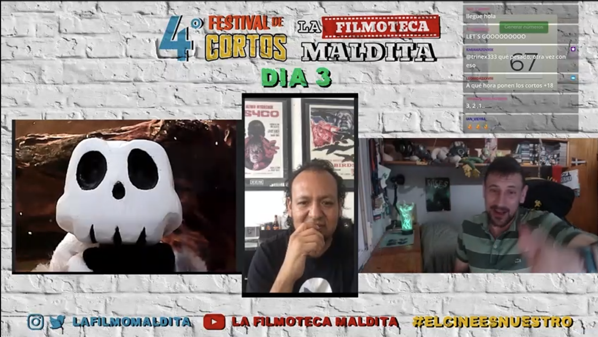

### Cortos

(Los votos mostrados son de gente que estaba en el Discord [de la Filmo] en ese momento. Puedes seguir el enlace para dejar tu voto **no oficial** y/o ver cómo evoluciona su votación.)

- 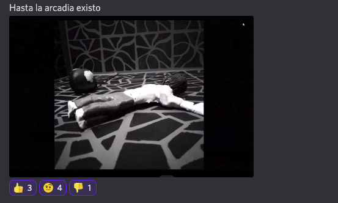  
[03/01](https://discord.com/channels/739208143523020841/769436011981570068/992886982680252507)  
guerrerobravo777: "*Pon el corto "Backwards" para entender el mensaje subliminal..."*;  
edvardo_96: "*pues no entendí, pero visualmente me gustó 7/10*";  
luis_e_mano [autor]: "*está en el infierno y al final se da cuenta que su vida no es nada; es un poema que cree para un momento tan malo que me pasó"*;  
Hergad: "*Referencia a Vincent de Tim Burton*".  
.  
.  
-   
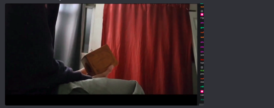  
[03/02](https://discord.com/channels/739208143523020841/769436011981570068/992889173080031242)  
AlexWerden: "*oye, pues curiosete y muy técnico, ha molado*";  
Alienigena_Ancestral: "*¡Ah, metaliteratura!*";  
titokrause: "*Planos desde arriba. Desde ventilador. Zoom a la caja. Jugó mucho con los planos sin que se haga demasiado evidente. Eran muy coherentes dentro de lo que quería explicar.*"  
.  
.  
- 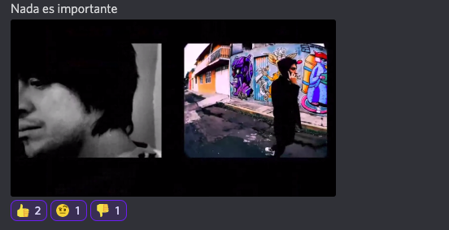 
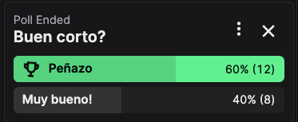  
[03/03](https://discord.com/channels/739208143523020841/769436011981570068/992892245659361410)  
alvarutiscg: "*Amores perros cuando habian perros y tremenda peli mexicana*";  
S_Fita: "*Entiendo que ha querido jugar con el audio, me gusta el juego visual y cosas que haces o intentas hacer pero has jodido el corto con el audio*";  
Elly: "*Te hace sentir como si realmente te agoviara lo mundano*".  
.  
.  
- 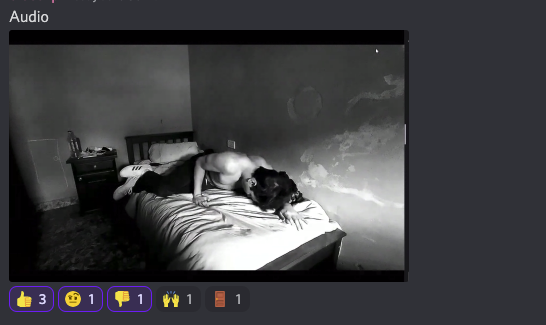  
[03/04](https://discord.com/channels/739208143523020841/769436011981570068/992895004894834761)  
marvin90kp: "*¡Qué difícil la masculinidad en tiempos postmodernos, peña!*";  
rafaelcrz: "*¡Vamos por ese Lav Diaz!*";  
Alienigena_Ancestra: "*Dross + David lynch + el sonido de un venado herido*".  
.  
.  
- 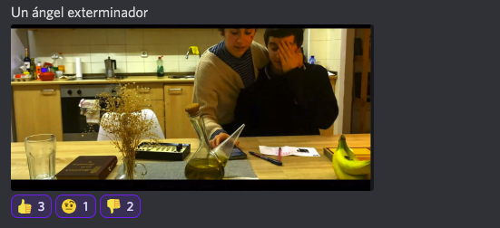  
[03/05](https://discord.com/channels/739208143523020841/769436011981570068/992897776000176259)  
elgatodeeris: "*Está homenajeando a Buñuel... ¡bien! [no se pueden ir de la casa porque hay una fuerza que lo evita]*";  
Electrip: "*A mi no me ha capturado y he visto el Ángel Exterminador (esa sí es buena) es que "su fuerza" es el exceso de diplomacia en esos tiempos... aquí no hay asidero para la situación*";  
esquizoide0: "*Me sé la referencia pero no veo el sentido a hacer un remake de 7 mins que no se sostiene sólo ni presenta una alternativa a la original*".  
.  
.  
- 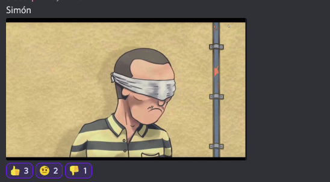  
[03/06](https://discord.com/channels/739208143523020841/769436011981570068/992901664845602827)  
KidPochoclo: "*Simón Radowitzky fue un militante obrero anarquista ucranio-argentino de origen judío. Fue conocido por el atentado con bomba que mató al jefe de policía Ramón Lorenzo Falcón, responsable de la brutal represión de la semana roja de 1909 en Buenos Aires.*";  
vidalhoaxer: "*Dice tanto con tan poco*";  
guerrerobravo777: "*Te pasa la vida en un segundo... una vida de opresión y de lucha*".  
Hergad: "*La gente inteligente habla con metáforas.*".  
.  
.  
- 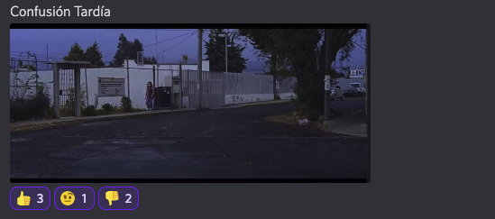  
[03/07](https://discord.com/channels/739208143523020841/769436011981570068/992904061298942013)  
mandacarallo2: "*La música es muy del tipo de la de las películas de Hictckock! En plan Bernard Hermann o algo así ....al estilo antiguo vaya... no sé a mí me recuerda al cine clásico*";  
Feo: "*Dice alguien: Lav Diaz [corto más largo] ¡ten cuidado!*";  
Ghwer: "*La idea es confundir al expectador con tantas escenas para que al final se dé cuenta... un persona que va a la escuela y aquel dia no había clases... y ya*";  
Hergad: "*Un videoblog de los años 80,... ¡aquí hace falta un drama!"*;  
jchavarria_cine: "*Se siente como una introducción, ¡nos faltó la película!*".  
.  
.  
- 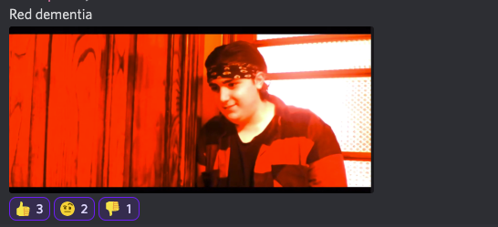  
[03/08](https://discord.com/channels/739208143523020841/769436011981570068/992907214601846905)  
mizraimn: "*Mucho texto, pasa muy rápido, y los colores no hacen contraste.*";  
spronchkyan: "*No interpreta mal, transmite la emoción*";  
travis_jazz: "*La elocuencia entre las transiciones reflejan un dinamismo a la hora de narrarnos la dinámica y el entrevesado subconciente del protagonista*";  
merlidelagua: "*Basta de culpa* [masculinidad frágil] *, la culpa no existe, a ver cuando nos hacemos cargo de nuestras decisiones; eso es lo que mas me molestó, creo*".  
.  
.  
- 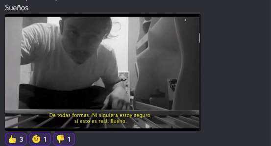
[03/09](https://discord.com/channels/739208143523020841/769436011981570068/992910281665683466)  
FilmotecaMaldita: "*Somos tipos, estamos estamos tristes, aparentamos ser duros, somos sensibles, tenemos problemas... Ser hombre es difícil en 2022. Llamadlo masculinidad deconstruida mejor q frágil...*";  
esquizoide0: "*Puro monólogo llorón... 🤦🏼‍♂️*";  
raysosab: "*La insoportable levedad del ser*";  
ggbyte_: "*No es lo mismo depre que masculidad frágil, eh?*";  
dristan_x: "*El tipo de negro representa su masculinidad tóxica*";  
Hergad: "*Hay recursos muy Lars Von Trier para pulir. Pero un poquito cliché: ¡luchando contra mí mismo!*".  
.  
.  
- 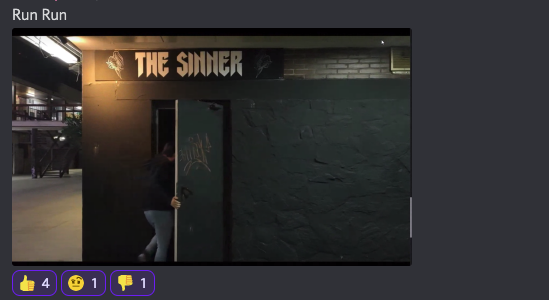  
[03/10](https://discord.com/channels/739208143523020841/769436011981570068/992913098900000828)  
malaquita08: "*¿A lo Hardcore Henry, no?*";
mongrelstrassenhund: "*Aunque hay coña en el chat... se debe reconocer que la trama y el ritmo son envolventes*";  
ElPorreteSabrosetee: "*Era todo un sueño de Resines*";
gombowombo: "*No entendí una verga, pero está muy bien realizado.*";  
angel_d_hurtado: "*¿tuvo final?*";  
Alienigena_Ancestral: "*Explicación del corto que acabamos de ver, el protagonista está desfasado en el espacio y el tiempo cada que entra en el bar*".    
.  
.  

[Volver al índice](../festi.md)