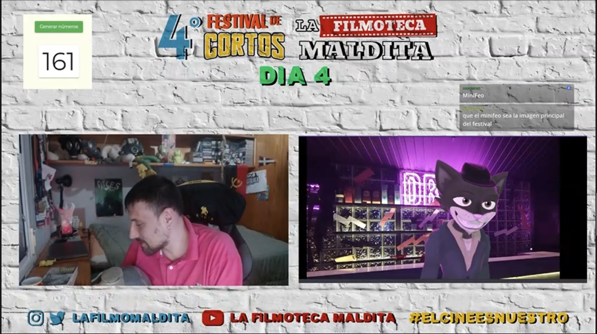
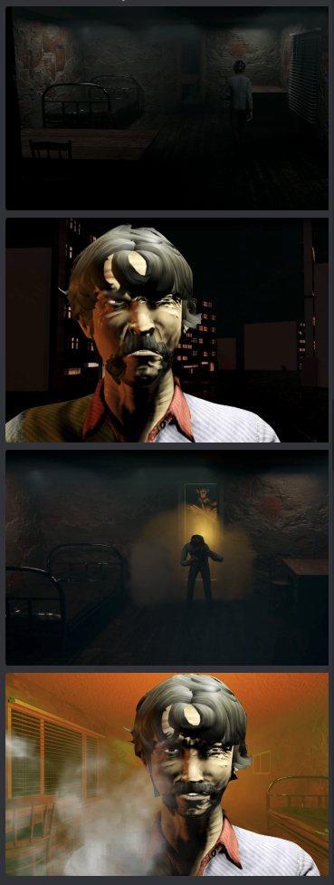

# Festival de Cortos de la Filmoteca Maldita 2022
[Volver al índice](../festi.md)

## Dia 4 04/07/2022 (Quetzal)

- 1 - **¿Me abrazas?** (corto 153) - JNK Atemiz  
- 2 – **Julia** (corto 150) - Josue Sanabria  
- 3 – **Encerrados** (corto 148) - Fernanda Salinas  
- 4 – **El ser más débil** (corto 68) - FirMistery  
- 5 – **Banana** (corto 6) - JUAN IGNACIO Irusta  
- 6 – **No es un lugar para crecer** (corto 131) - Jesús Coello  
- 7 – **Días de días** (corto 63) - Sneaky 13456  
- 8 – **Recuerdos** (corto 50) - Andrés Correa   
- 9 – **Lluvia de ideas** (corto 8) - Kevin Zahid  
- 10 – **El llamado de la tierra** (corto 123) - Demetrio Ayala
- 11 – **Pongan el 115** (corto 115) - Edward 115, trinex

### Cortos

(Los votos mostrados son de gente que estaba en el Discord [de la Filmo] en ese momento. Puedes seguir el enlace para dejar tu voto **no oficial** y/o ver cómo evoluciona su votación.)

-   
[04/01](https://discord.com/channels/739208143523020841/769436011981570068/993254832481767464)  
Quetzal: "*Denle amor a ese chico!*  
ElonMunsk:  
  
.  
.  
-   
[04/02](https://discord.com/channels/739208143523020841/769436011981570068/993255835465691187)  
mizraimn: "*Una muchacha que se va a la ciudad con el fin de buscar un futuro mejor porque huye de algún peligro.*";  
el gf: "*tiene produccion ese celular*";  
Antz: "*se lo curraron*".  
.  
.  
-   
  
[04/03](https://discord.com/channels/739208143523020841/769436011981570068/993257446577537064)  
elpulentoso2019: "*joder, sin palabras, plano secuencia largo y con metaforas, para mi es cine*";  
guerrerobravo777: "*El niño esta confinado... y odia a la madre por que no lo deja salir?*"  
.  
.  
-   
  
[04/04](https://discord.com/channels/739208143523020841/769436011981570068/993260106861006958)  
matuterecomienda: "*Tiene algo de Lovecraft con el horror cósmico.*";  
lisandroof: "*Tremenda cinemática, ahora empieza el gameplay*";  
Quetzal: "*¡Mucho texto! Show don't tell!*".  
.  
.  
-   
[04/05](https://discord.com/channels/739208143523020841/769436011981570068/993262601641398393)  
Quetzal: "*Warhold ya se comió una hamburguesa y tiene más erotismo que tú comiéndote una banana. Si al menos hubiera puesto ojos de puta, caída de párpados, o algo...*".  
.  
.  

-   
  
[04/06](https://discord.com/channels/739208143523020841/769436011981570068/993263813879144579)  
nachohache1978: "*Parece un proyecto de gente que empieza pero pueden llegar lejos si siguen trabajando*";  
Quetzal: "*Bien, pero tijera.*";  
comemurcielagos: "*no ir a guayaquil, entendido*";  
a_ltgr_: "*la idea estaba buena, pero le falto algo de dinamismo... y el audio te saca mucho.*"  
.  
.  

-   
  
[04/07](https://discord.com/channels/739208143523020841/769436011981570068/993266661832523877)  
Alienigena_Ancestral: "*parece ser sobre un trabajador que está cansado y llega a casa.*";  
a_ltgr_: "*tarda en arrancar, pero me encanta el concepto. Esta muy bien como aprovecha sus cuadros. Ayudaria alguna historia o elemento narrativo*";  
titokrause: "*a mi me gustó. siguió la historia a traves de cuadros*";  
eldugijones: "*jan smakvajer*".  
.  
.  

-   
[04/08](https://discord.com/channels/739208143523020841/769436011981570068/993268846851014737)  
FilmotecaMaldita: "*faltó pasión, he visto a primos darse besos con más alegría... se me ha subido el azúcar, con mi sangre voy a poder estar alimentando a gato varios meses...*";  
elecktrip: "*Recordé que recordaba y aun me queda el recuerdo. Mantén vivo el recuerdo... del recuerdo aquel.*";  
elpulentoso2019: "*ALguien me abraza? porfa, me dio penita*";  
ggbyte_: "*el final hace que valga la pena aunque un poco de tijera a lo mejor*";  
raysosab: "*clara referencia a la rosa de Guadalupe.*".  
.  
.  

-   
[04/09](https://discord.com/channels/739208143523020841/769436011981570068/993271262690418739)  
mizraimn: "*eso es el proceso creativo luego de ver Creepypastas*";  
elpulentoso2019: "*se nota la influencia del anime*";  
shadowceless: "*me identifico demasiado con este pibe, Le entiendo*";  
a_ltgr_: "*pues si queria demostrar que puede realizar diferentes tipos de ambientacion, lo ha logrado*";  
Feo: "*Mis dieces!*";  
Quetzal: "*Y los míos!*".  
.  
.  

-   
  
[04/10](https://discord.com/channels/739208143523020841/769436011981570068/993273930817212416)  
thomasblock3: "*hubiera sugerido que dure mas*";  
jaxsafilmdirector: "*La animación está chula*";  
rickkkk_sm: "*directo y conciso*";  
heartofthewoods: "*Mmmmm. Curioso. Entiendo que es un corto con poco medios, pero no me acaba de gustar el resultado a nivel estético*";  
elpulentoso2019: "*ESTO CINE PURO!, si el otro fue una oda a lo dinamico del cine, esto es lo que el cine abtracto deberia ser*";  
Elly: "*el diseño de sonido es muy bueno, tambien el timing de la animacion es bueno*".  
.  
.  

-   
  
  
[04/11](https://discord.com/channels/739208143523020841/769436011981570068/993275522685607956)  
KidPochoclo: "*NO DIOS CERREMOS HOY EL FESTIVAL*";  
a9a9aa99: "*El 115 es una carta de amor al 115*";  
mizraimn: "*JODER SE ROMPIÓ LA CUARTA PARED*";  
Mr_Roez: "*la reina de los ansiolíticos jajajaja me encantó*";  
s_y_n_g_o: "*rompió la matrix*";  
Mopar2730: "*Adelantado a su época*";  
DavoxtTW: "*yo ya estoy llorando por esta maravilla*";  
shadowceless: "*Estuvo mejor que el año pasado*";  
xajpot: "*SI JOKER FUERA BUENA PELÍCULA*";  
Quetzal: "*Podría haberlo filmado Ryan Murphy! (me voy a tatuar '115' en la polla; en el huevo izquierdo pondré un código QR con enlace al corto del año pasado; y en el huevo derecho el de este año; cada vez que alguien quiera follarme y quiera acceder al sacro totémico entre mis piernas tendrá que ver estas piezas*";  
Maquiavelo: "*La peor dirección de actores que he visto en mi vida. Una trama de Nolan con estilo Lynch del tres al cuarto, tipo el bazar chino de abajo de mi casa. ¡Decepcionante! Una mierda pintada de originalidad.*"  
Feo: "*Yo lo he visto supermetafórico. Es un payaso pidiendo que se ponga el 115.*".  
.  
.  

[Volver al índice](../festi.md)