# Festival de Cortos de la Filmoteca Maldita 2022
[Volver al índice](../festi.md)

## Dia 5 04/07/2022 (Rottenmind + Yoshimichu)
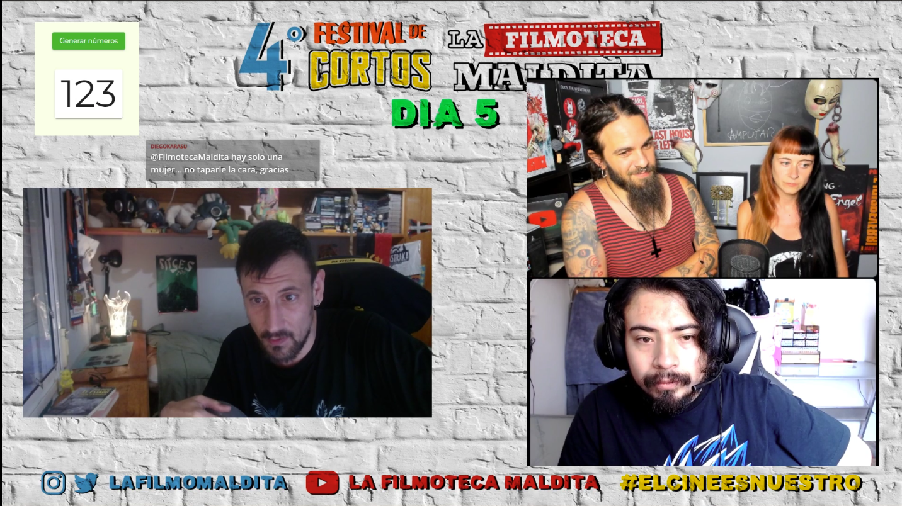

- 1 – **Un ensayo sobre flores** (corto 151) - Sarela Roel   
- 2 - **Mera sugestion** (corto 45) – Maty Ojeda   
- 3 - **Animita** (corto 11) - Israel Salinas   
- 4 – **Lasaña** (corto 22) - Juano Kensighston   
- 5 – **Dejame tranquilo Soledad** (corto 90) - Andes Oswaldo Pacheco Perez   
- 6 – **Trailer** (corto 157) - Ocelot
- 7 – **Buscando el premio** (corto 160) - Juanita Rosenberg  
- 8 – **Derecho del pueblo** (corto 102) - champ II   
- 9 - **EL paso del tiempo** (corto 37) - Hernan Orozco   
- 10 - **El regalo** (corto 112) - Gilbela   
- 11 – **La foto** (corto 155) - Lars Thorwald   

### Cortos

(Los enlaces llevan al canal de Discord "Chat sin micro" donde vimos juntos el festi)

- 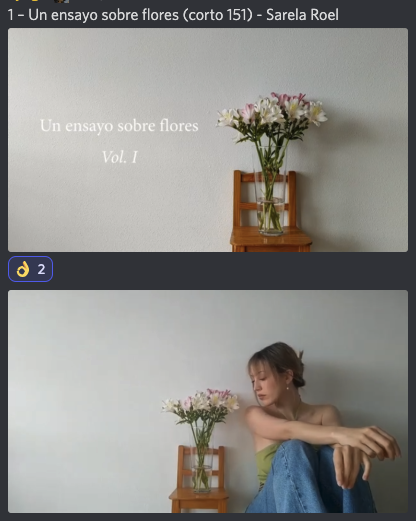  
[05/01](https://discord.com/channels/739208143523020841/769436011981570068/993609395223142401)  
xBENIT0x: "*el insta de la chica ? es para una tarea*";  
matuterecomienda: "*Tiene un aire a Nicki Nicole*";  
anjasaro: "*Broken flowers*";  
s_y_n_g_o: "*lindas alstroemerias :3*";  
rottenmind: "*¿Por qué las flores olían mal?*";  
KaramazovXIX: "*Pues quiere decir que, aunque en apariencia sean bonitas, por dentro son feas. por eso olían mal. no sé xDDD*";  
tormentadelagartos: "*no hay premio LYNCH?*".  
.  
.  
- 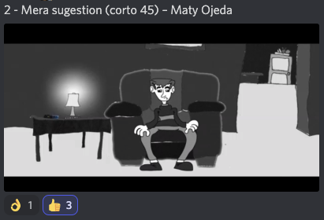  
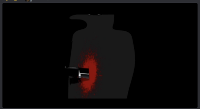  
[05/02](https://discord.com/channels/739208143523020841/769436011981570068/993610630198218843)  
emmanuelelele: "*el fe0 fantasma asustando: ey que pasa peñaaaa?*";  
LulaBeeLula: "*buena edición sonora*";  
pandasticat: "*Esta jornada de cortos la estan tomando los fans de David Lynch XD*";  
a_ltgr_: "*me encanto la animacion... muy bien trabajado el ambiente, las texturas.*";  
0scar6omez: "*Siento que la temática de terror contrasta con la animación que sugiere ser satírica. es un corto interesante 'Mera sugestión'*".  
.  
.  
- 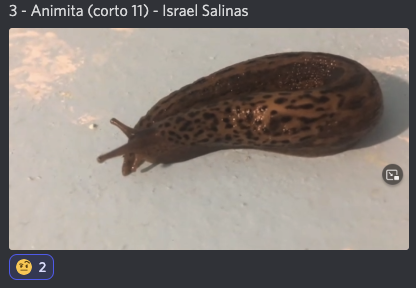  
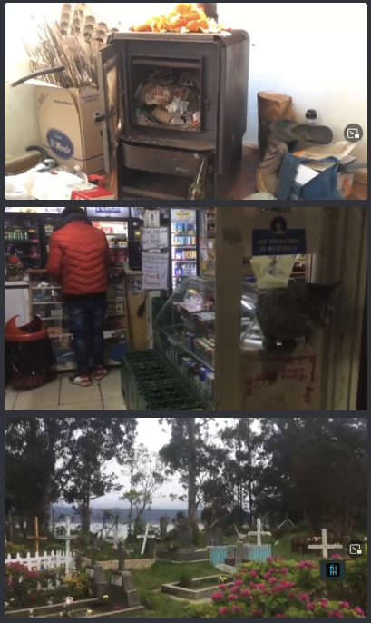  
[05/03](https://discord.com/channels/739208143523020841/769436011981570068/993612496239865877)  
LulaBeeLula: "*se esforzó mucho con el arte!*";  
DopelOzno: "*una crítica a la basura? 🧐*";  
rottenmind: "*A ver, que sí, habla del alcoholismo, la represión policial, la ignorancia del pueblo y tal, sí todo esto, pero está grabado muy random, tendría que haberse centrado en algo... que no le quito mérito*";  
pandasticat: "*parece documental*";  
AlexWerden: "*demonios, esto es puro cine indie como el yankie este, no me acuerdo. el que queda de dos hermanos de la escena underground.*".  
pastoriida: "*No manches. Suena a que es en Chile, pero en serio podría ser en cualquier poblado de las afueras de Ciudad de México. Estamos hermanados por la podredumbre y las caguamas.*"  
.  
.  
-   
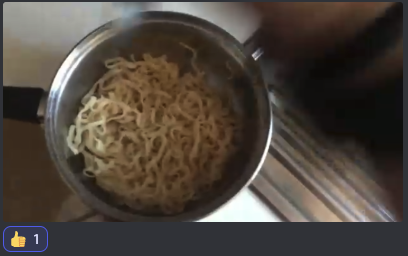  
[05/04](https://discord.com/channels/739208143523020841/769436011981570068/993615146855436429)  
KShazam: "*creo que fue una amenaza a la mafia italiana*";  
rotten: "*Juego de palabras: Lasaña, se ensaña*";  
Feo: "*Al autor del corto: 'Pásate por el Discord que te demos amor, tio! ¡No estás solo! Hay una comunidad aquí que te quiere, tal vez lo tuyo haya sido lo más extremo que hemos visto de masculinidad frágil! ¡Buen juego de palabras!'*";  
Yoshimichu: "*Hay gente muy extraña en este canal!*"  
.  
.  
- 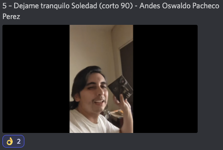  
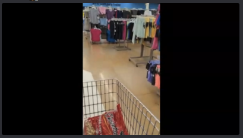  
[05/05](https://discord.com/channels/739208143523020841/769436011981570068/993616188250783784)  
rickkkk_sm: "*El feo no exageraba, de verdad es el año de la masculinidad fragil*";  
louli_as_niwas: "*no entiendo entonces si le habla a su mamá o a la mamá de su hija*";  
suicypay616: "*miren como se desarrollo el tipo.... que gran guion*";  
satiavan: "*Animo que hace falta valor para animarse a actuar*";  
Mefistofeles3: "*Con este festival me di cuenta que estamos muy solitos, necesitamos un abrazo hajaj*";  
jorgericardo2004: "*roman polanski : biopic*";  
Alienigena_Ancestral: "*Creo que es un round futage de TikTok de un chico que mató a su mamá en el contexto de una guerra de narcos*"  
Rottenmind: "*Me ha gustado, pero esas improvisaciones se delataban un poco  y la cámara del final rompe el futage*"  
.  
.  

- 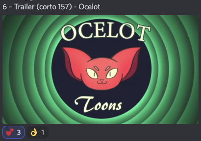  
  
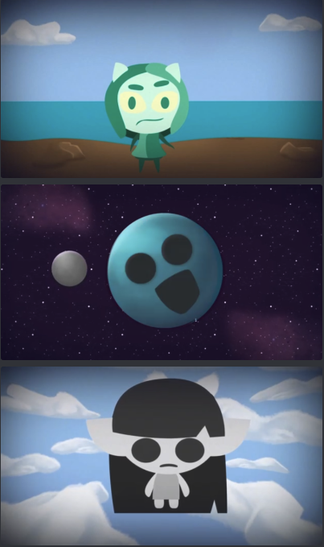  
[05/06](https://discord.com/channels/739208143523020841/769436011981570068/993619639957458985)  
victor_mv23: "*que suave voz tiene el diablito furro*";  
travis_jazz: "*La ultima gran obra de la humanidad, morbius*";  
el gf: "*un video de youtube de un furro*";  
5y5t3m32: "*Esta bastante linda la animacion*";  
Rotten: "*Un cliché un poco aburrido... es un mensaje que hemos oído muchas veces.*";  
Feo: "*Echo en falta un poco de movimiento, otros años tenía más movimiento. Felicidades por Trailer!*"  
suicypay616: "*tiene futuro de animador*"  
.  
.  
- 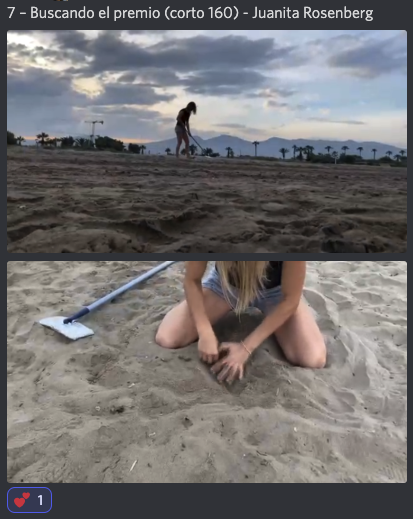  
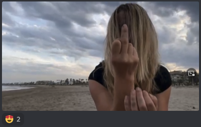  
[05/07](https://discord.com/channels/739208143523020841/769436011981570068/993621708365910078)  
jorgericardo2004: "*denle el lav diaz*";  
Mr_Roez: "*espero que haya un cadáver, algo, que me está dando diabetes*";  
exxochiquito: "*Nosotros somos el corto*";  
pandasticat: "*Terrence Malick momento*";  
merlidelagua: "*monty phyton*";  
caimanmedial: "*A Tarantino le gusta esto*";  
guerrerobravo777: "*Hack life: detector de metales con papel aluminio....*";  
ElMismisimoMandinga: "*primer cortometraje de stanley kubrick documentado*";  
PosYoKeSe: "*La obra que conmovio a Spilberg*";  
al_g_narvaez: "*ya denle los 10000 dólares*";  
JpCortez0: "*Premio a la mejor fotografía para un corto troll, chabón*"  
.  
.  
-   
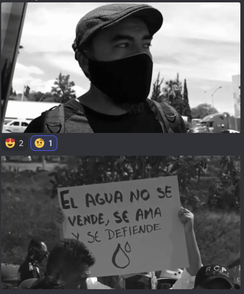  
[05/08]()  
aline_kleine: "*Corto político Mexicano*";  
bl3d: "*La musica es de Sewerslvt  Mr. Kill Myself*";  
malaquita08: "*me apetece irme de mani y despues de rave, quien se apunta?¿*";  
Alienigena_Ancestral: "*por el acaparamiento de agua de las empresas*";  
mizraimn: "*Yo nunca he hido a una protesta con estos rolones*";  
pegotiao: "*la música hace referencia al sistema ajustando sus tuercas*";  
diezisieteoportunidades: "*Artículo 3. 1. La fase atmosférica del ciclo hidrológico sólo podrá ser modificada artificialmente por la Administración del Estado o por aquellos a quienes ésta autorice (art. 3 del TR de la LA). Toda actuación pública o privada tendente a modificar el régimen de lluvias deberá ser aprobada previamente por el Ministerio de Obras Públicas y Urbanismo*";  
Rottenmind: "*A ver, la protesta y la reinvidicación merece el espacio, pero quizás en un festival de cortos no es el sitio... como documental muy bien, pero como obra de creación faltaría (recuerden a System of a Down: boom!*"  
Feo: "*Vemos la protesta, pero si quieres visibilizar una causa, faltaría ver un poco qué efectos, qué problemática, envolver la lucha para entenderla bien desde un punto de vista más amplio. Aunque todo el mundo conoce en líneas general, pero falta más señalar a los culpables, qué consecuencias...*"  
.  
.  
- 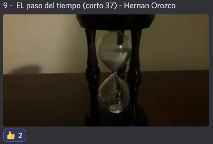  
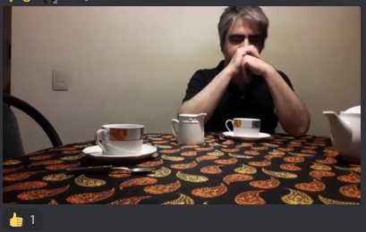  
[05/09](https://discord.com/channels/739208143523020841/769436011981570068/993626636517920789)  
satiavan: "*Se fue tan rapido como llego*";  
exxochiquito: "*bien pero me quede con mas*";  
SoundWiburn: "*¿Ya a acabo? Vaya. Me mojo los pies y nada más.*";  
ggbyte_: "*hay gente que ni lo intenta y no le dicen nada y gente que lo intenta y se la comen, mi no comprende*";  
guerrerobravo777: "*Definicion de POESIA: Leer un fragmento De POE con musica de fondo de SIA...*";  
Rottenmind: "*Faltó que el autor revisara y comprobara si realmente ha logrado transmitir; se quedó un poco en la foto para la red social*"  
.  
.  
- 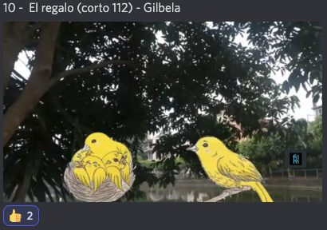  
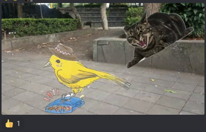  
[05/10](https://discord.com/channels/739208143523020841/769436011981570068/993628955787673690)  
guerrerobravo777: "*Premio a los mejores efectos especiales...*";  
AlexWerden: "*LO HA MATADO SECUUUU NOOOO!!!!*";  
rickkkk_sm: "*feo, controla a tu gato*";  
r4f24el: "*interesante la forma de animar la historia*";  
s_y_n_g_o: "*nooo secu kehiciste :3*";  
exxochiquito: "*Que bonita tragicomedia*";  
aline_kleine: "*nooooooo, yo no dejo a mis gatos cazar les quito lo que traigan pobrecitos pajaritos*";  
lukenivuak: "*Este si conmovió a Spilberg*";  
diegokarasu: "*#MANTENLOENACASA a los dueños*";  
5y5t3m32: "*Es algo interesante, no es algo comun en lo que piensan todos*";  
S_Fita: "*Original y práctico*";  
Alienigena_Ancestral: "*Una mama pajaro muerta no podrá criar sus pichones y se mueren de hambre*";  
caimanmedial: "*Diganle a la persona creadora que si es tan antiespecista no les diga DUEÑOS a quienes cuidan animales jajaja*";  
Feo: "*[Se le viene Gato al micrófono] Sí, están hablando de ti!*"  
.  
.  
- 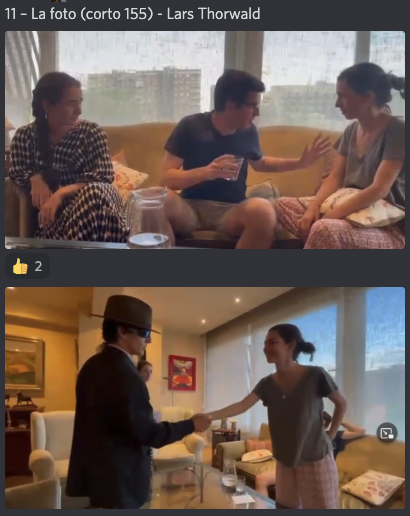  
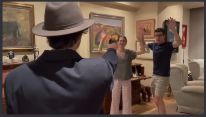  
[05/11](https://discord.com/channels/739208143523020841/769436011981570068/993628955787673690)  
nachohache1978: "*este corto parece hecho por estudiantes de instituto o audiovisuales*";  
rafaelcrz: "*telenovela de televisa*";  
alvaroytalytal: "*mu buena la ensaladilla rusa*";  
victor_mv23: "*Actuación 100% convincente*";  
kanutonov: "*el abuelo era el rey juan carlos*";  
pandasticat: "*MAQUIAVELO QUE HACES*";  
AlexWerden: "*esto es un poco Jess Franco con Al pereira de personaje. no me disgusta, la verdad*";  
nachohache1978: "*les damos con un Óscar o con un Goya? xD*";  
marmota_feroz: "*en realidad tiene una puesta de escena muy teatral, como el cine de ingmar bergman*";  
Rottenmind: "*Me ha recordado a mí en los inicios haciendo teatro... esas comedias absurdas que no acaban de convencer."*";  
elecktrip: "*a mi me ha gustado que jueguen con el cliché*"  
.  
.  

[Volver al índice](../festi.md)