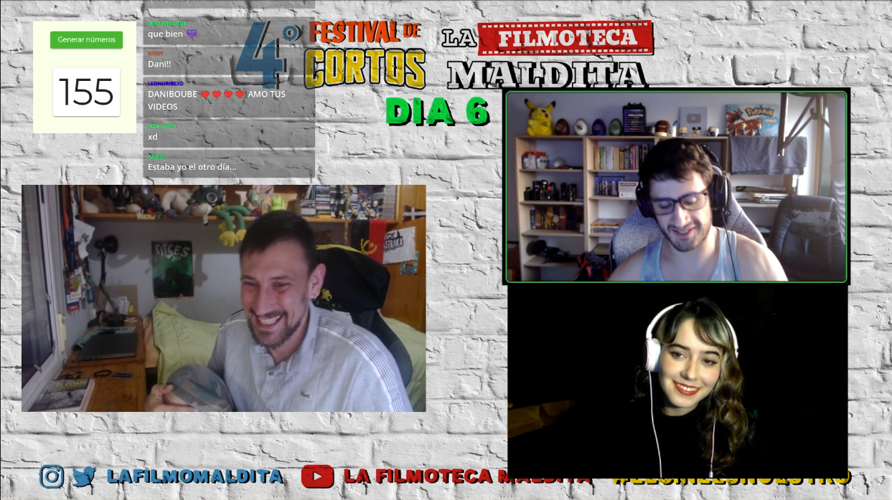
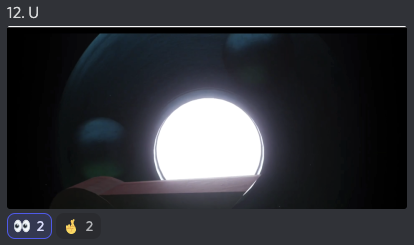

# IV Festival de Cortos de la Filmoteca Maldita 2022
SITIO FANTEAM NO OFICIAL  
[Volver al índice](../festi.md)

## Dia 6 05/07/2022 (DaniBoubeTv + Kenia)

DIA 6 – DANIBOUBETV & KENIA
- 1 - **Yasha Gozen** (corto 162) - Sylvain wain Dezaki 2.0
- 2 – **Virus** (corto 91) - razflick 
- 3 - **Je me Souviens Encore** | remake 2ª edicion (corto 117) - Ugly Doll 
- 4 - **Qui sent musica** (corto 60) - Marina Rueda
- 5 – **Agua negra** (corto 154) – Oscar P
- 6 - **Protestas: Una historia** (corto 75) - NFOP Producciones
- 7 - **10062022Burgo** (corto 73) - Andrés Torrejón Páfila
- 8 - **Infinity Projections** (corto 79) - Lorenzo Vasek
- 9 – **Nota roja** (corto 158) - Lo Pascalo Films
- 10 – **Pequeños negocios** (corto 129) - Daniel Regidor 
- 11 - **Yace en el lugar de la luz** (corto 1) - ayrton mallma
- 12 – **U** (corto 15) - Alejo Malia

### Cortos

(Los enlaces llevan al canal de Discord "Chat sin micro")

-   
  
[06/01](https://discord.com/channels/739208143523020841/769436011981570068/993972422682353764)  
matuterecomienda: "*Anime indie de bajo presupuesto ME ENCANTA.*"  
kevin_zahid: "*La influencia al cine japones de los 40 o al Anime creo yo*";  
jorgericardo2004: "*8.5/10*";  
diegokarasu: "*el corto me pareció una "carta de amor" al film ONIBABA (1964). Felicidades al creador*"  
.  
.  
-   
[06/02](https://discord.com/channels/739208143523020841/769436011981570068/993974457553141891)  
josemellinas: "*Directed by Zack Snyder*";  
titokrause: "*bien bien. con recursos justos contó una historia coherente y que atrapa.*";  
DaniBoube: "*Corregir el click de sonido en un momento álgido.*";  
Kenia: "*Me recuerda a ese arte gráfico francés, de mezcla de estilos... Mi problema es la combinación de elementos, demasiada.*";  
Feo: "*Deja testimonio de una vivencia personal que no suele verse en los medios. Estas cosas tan personales e íntimas tienen su gracia.*";  
alvarutiscg: "*al fin un documental que me haga reflexionar y no bailar como ayer*"  
.  
.  
-   
[06/03](https://discord.com/channels/739208143523020841/769436011981570068/993976528209715263)  
DaniBoube: "*El mensaje queda claro, una mujer maltrada...*";  
Kenia: "*¿Qué significa el color del final?*";  
leonactorx: "*me parece que al final está viendo las noticias... pero fue tan rápido que no entendí si había algún símbolismo*";  
kanutonov: "*muy buena elección musical,cuenta mucho con las tomas pero habló en francés 8/10*"  
kevin_zahid: "*El color reprenta la realidad de la mujer que está siendo maltratada*";  
Feo: "*Buenos planos, buen trabajo de fotografía*"  
.  
.  
-   
[06/04](https://discord.com/channels/739208143523020841/769436011981570068/993977594145931318)  
kcrinein: "*Aquest és el primer curt que he vist en català*";  
heartofthewoods: "*creo que es mallorquín: ses flors*";  
elgatodeeris: "*el inicion del girasol me parecio muy chulo*";  
bpaoletti: "*me parece precioso éste corto*";  
Alienigena_Ancestral: "*Así se hace una retrospeccion*";  
heartofthewoods: "*Me mola este corto. Muy intimista*";  
matuterecomienda: "*Con voz en off y planos largos y estaticos consigue no volverse aburrido. Eso es un montón.*";  
mandacarallo2: "*La voz de la chica es preciosa y lo narra de maravilla...me pareció genial*"  
.  
.  
-   
[06/05](https://discord.com/channels/739208143523020841/769436011981570068/993979819266150493)  
elmario8900: "*en México las empresas refresqueras y cerveceras han tomado el control del agua y recientemente están provocando desabasto tremendo en algunos lados principalmente Monterrey Nuevo Leon*";  
rickkkk_sm: "*el man que lo hizo le sabe a la dirección*";  
alberthans1: "*Coca Cola una crítica a la falta de agua*";  
Elly: "*algo que me gusto es que el tipo solo tiene un dialogo y dice solo "es que en mi casa no tenemos agua"*";  
heartofthewoods: "*La persona que dirige esto se nota que tiene idea de cine*";  
kevin_zahid: "*Critica a las compañia refresqueras que desperdician agua*";  
s_y_n_g_o: "*APA la papa que interesante*";  
JpCortez0: "*Bro, se usan 30 litros de agua para producir un litro de Coca. Es una mierda*";  
DaniBoube: "*Me dejó pensando, es como que le falta una segunda parte...*";  
Feo: "*Me ha parecido genial la mezcla de técnicas*"  
.  
.  

-   
[06/06](https://discord.com/channels/739208143523020841/769436011981570068/993982049251774515)  
vidalhoaxer: "*Cuanto tiempo le tomo hacer eso?*";  
serrato_0: "*carta de amor a la ultraviolencia*";  
marvin90kp: "*Oye fe0 exista un premio "Sam Peckingpack" a mejor corto ultraviolento*";  
DaniBoube: "*¡Pura violencia! Que lo contraten para una peli de Lego +18*";  
heartofthewoods: "*La narrativa está logradísima para estar el corto hecho con lego*";  
elgatodeeris: "*calidad y muy buen sonido*";  
Rebel Soul Tech: "Es flipanteee*";  
bernaaaaaaaaaaaaaaa: "*me quede con ganas de mas*";  
ElPorreteSabrosetee: "*Legolución*";  
Kenia: "*Muy currao!*";  
Feo: "*Un minuto a 12 frames por segundo, echa cuentas...*"  
.  
.  
-   
[06/07](https://discord.com/channels/739208143523020841/769436011981570068/993983790961664031)  
PatxiRuiz: "*el audio no va un poco a su rollo? o soy yo?*";  
a9a9aa99: "*Será a propósito el audio desfasado o se fue a la mierda el vídeo?*";  
sininspiracion: "*Son entrevistas ¿Cuenta como corto?*";  
Ghwer: "*puro avant garde*";  
jorgericardo2004: "*roma gallardo edición 2050*";  
heartofthewoods: "*ufff, los objetivos de desarollo sostenible. a ver si sacan algo interesante*";  
aresama99: "*son los objetivos de la onu para el 2030 creo, todos los gob, se compremetieron para cumplirlos.*";  
marvin90kp: "*De verdad xreen que llegaremos al 2030*";  
mandacarallo2: "*marvin90kp Sí! Mal pero llegaremos ...no siendo que nos mate antes la propia naturaleza*";  
brunoascar: "*por qué estamos dejando que pase enotnces?*"  
.  
.  
-   
[06/08](https://discord.com/channels/739208143523020841/769436011981570068/993986568207486976)  
PosYoKeSe: "*huele a bellas artes xD*";  
merlidelagua: "*esto es lo que nos gusta*";  
rickkkk_sm: "*FEO DALE EL PREMIO DE UNA VEZ*";  
xajpot: "*Este se sacó la tula y nos la retrego y ke gusto*";  
PosYoKeSe: "*Oscar y Grammy a mejor animacion*";  
ggbyte_: "*ou mama*";  
carlos_xlafilmo: "*Pero el retrato que ha hecho de la vida urbana!!! Madre mía!!!*";  
Kenia: "*El estilo es impresionista, me ha parecido espectacular!*";  
Feo: "*Hay que tener en cuenta que aquí no hay 300 animadores, es un tipo solo... ¡Muchas felicidades!*"  
.  
.  
-   
[06/09](https://discord.com/channels/739208143523020841/769436011981570068/993987750208475186)  
plzn_: "*Nota roja es la nota policíaca*";  
a9a9aa99: "*Es hermoso, cómo las pinches noticias de todos los días de mi México surrealista*";  
lukenivuak: "*fiel reflejo de gobernantes de latam*";  
merlidelagua: "*jajajajajajajajajja, es lo que hacen los politicos, es una buena parodia*";  
alberthans1: "*parece chiste y parodia de nuestros políticos pero en latan es anécdota*";  
fede_kelgar: "*el corto se debería llamar: ''Aquí Procurando Procurar''*";  
heartofthewoods: "*Ojala el Procurador procure callarse*";  
alvarutiscg: "*el procurador y el chocotorro. el corto*";  
braineater23: "*Ojalá esto sólo fuera sólo algo de un corto, tristemente es una parodia de los funcionarios políticos en México pfff*";  
JpCortez0: "*No es parodia; es una sátira.. Y muy buena.*";  
DaniBoube: "*Chacotorro, cilantro, estamos gordos y tal... ¡se entiende el chiste!*";  
Feo: "*Trabajando duro para el Bela Tarr*"  
.  
.  
-   
[06/10](https://discord.com/channels/739208143523020841/769436011981570068/993990685411778603)  
errtercero: "*esta super bien animado, parece real*";  
lisandroof: "*minifeo>mono*";  
hariment: "*Monofeo*";  
brunoascar: "*un animal antropomorfo que fuma*";  
CartoonsDR [autor]: "*Se supone que si que es una rata jajaja 🐀*";  
nachohache1978: "*me mo la mu cho... se las da con queso*";  
JpCortez0: "*Por acá un "queso" es un porro XD*";  
KaramazovXIX: "*Me ha molado. Tiene que ajustar algunos detalles, pero está chulo*";  
tamaralg391: "*Detallazo la vista del raton en color y blanco y negro*";  
nachohache1978: "*una serie para ese ratón ya xD*";  
CartoonsDR [autor]: "*Puse las voces me grabé a mi mismo todo 100% me alegra que os guste🧀*";  
Feo: "*Te felicito, ¿has tirado de Character Animator? (como el minifeo)*";  
CartoonsDR: "*Con Toon boom Harmony*"  
.  
.  
-   
[06/11](https://discord.com/channels/739208143523020841/769436011981570068/993993591401758750)  
lisandroof: "*es el capitulo de snk en el bosque*";  
mandacarallo2: "*Qué bonito es el ruido del agua*";  
danielchr20: "*tarkovsky sin estabilizador*";  
ilusomental: "*Perdonen amigos, me olvide de apagar la camara. Asi se llama el corto(?)*";  
KaramazovXIX: "*Grabar cosas no es hacer cine. 🙃*";  
thejuvenal: "*muere de envidia michael bay*";  
brunoascar: "*serán siete minutos de planos de paisajes?*";  
KrassDj: "*Me dan ganas de irme. Lejos, muy lejos.*";  
lisandroof: "*denle el lav diaz por favor*";  
baxerri1: "*ya suficiente bela tarr que le den el premio y a otra cosa*";  
CarloselSocio: "*Pues, está bonito*";  
elmaecr2: "*creo que quiere transmitir paz, serenidad...*";  
jorgericardo2004: "*la bruja de blair pero sin bruja, y sin miedo y sin nada*";  
avradox: "*bueno el perro es lo unico bueno en este corto*"  
.  
.  
-   
[06/12](https://discord.com/channels/739208143523020841/769436011981570068/993996113172512798)  
KaramazovXIX: "*Ponlo otra vez que creía que era la intro jakajsjs*";  
al_g_narvaez: "*buen intro, le falta el resto*";  
mandacarallo2: "*Qué bueno !! Increíble!!*";  
yezhacker: "*UwU*";  
a_ltgr_: "*que texturas mas increibles, no me imagino cuanto trabajo dio animarlo*";  
PosYoKeSe: "*buen render*";  
nachohache1978: "*U productions presenta:*";  
paul38104: "*simplemente U*";  
leonactorx: "*fue la intro de un Game*";  
paul38104: "*0% violencia 0% drogas 100% U*";  
Feo: "*El autor comentó que era una prueba de texturas...*"  
.  
.  

[Volver al índice](../festi.md)