# IV Festival de Cortos de la Filmoteca Maldita 2022
SITIO FANTEAM NO OFICIAL  
[Volver al índice](../festi.md)

## Dia 7 06/07/2022 (Preguntas Incómodas)
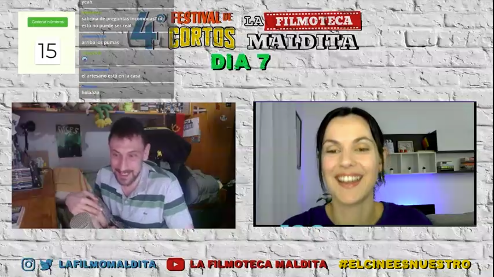

- 1.    [77] **Clarividencia** - Luis David Monfil González
- 2.    [83] **Ratametraje** - Satán Orbis
- 3.    [78] **Noche23** - Alex Moncayo
- 4.    [38] **La solitudine é una cosa bruta** - Ambra Dell´Aversano
- 5.    [13] **Limbo** -  Rasec Depablos
- 6.    [36] **Rojo y Azul** - Strange Realities
- 7.    [23] **El otro choque** - J.E Antonioni 
- 8.    [26] **Curvilinea** - Manuel Tell
- 9.    [147] **Elvia** - Fernanda Salinas 
- 10.    [30] **Animal definitivo** - Rafael Arévalo 
- 11.    [32] **La amistad** - Juan Pronko

### Cortos

(Los enlaces llevan al canal de Discord "Chat sin micro")

- 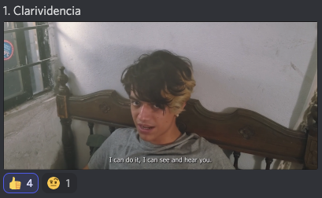  
[07/01](https://discord.com/channels/739208143523020841/769436011981570068/994337610858242128)  
merlidelagua: "*Me gustó, pero si es verdad que el diálogo hacia el final estuvo muy explicito*";  
2oraclos4: "*ta lindo eh sin pretensiones*";  
elgatodeeris: "*mola mucho, tiene un aire a "todo a la vez en todas partes" y a Doc Who*";  
a_ltgr_: "*esta bueno, los planos estaban bien pensados, solo le faltaba algo de fluidez en los movimientos*";  
diegokarasu: "*tiene cierto homenaje a ABRE LOS OJOS*";  
brunoascar: "*a la mrda con doctor strange aquí si hay arte*";  
Preguntas incómodas: "*Esto es cine postpandemia total*";  
lisandroof: "*la música estaba buenísima, todo tenso*";  
Feo: "*Me ha gustado mucho la dirección de fotografía y qué bien ha metido los efectos de audio.*";  
estudiomeztli [autor]: "*muchas gracias por sus comentarios se los agradezco*"  
.  
.  
- 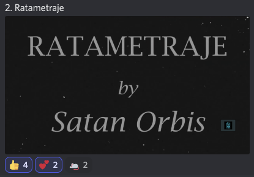  
[07/02](https://discord.com/channels/739208143523020841/769436011981570068/994339356531773500)  
satiavan: "*Buenaza la musica eh*";  
AlexWerden: "*¿seguro q no es musica de algun lugar? es muy buena*";  
andrevesaliusmd: "*Joy Division, justamente esa cancion habla de la cuarentena*";  
alvarutiscg: "*me recuerda al juego de Dumb ways to die*";  
RelatosColapsistas: "*otro corto bien animado ole*";  
charlie_is_omega: "*Peak cinema*";  
LulaBeeLula: "*no necesita dialogos*";  
maevinler: "*Mola la animación, pero me sobra el filtro vintage 35 mm*";  
titokrause: "*no había llorado así por la pérdida de un personaje desde Juego de tronos*";  
charlie_is_omega: "*Me recuerda muchísimo a Cat Soup pero esta vez los humanos son los terroríficos*";  
El_Homi_64: "*K grande, me dieron ganas de quemar iglesias y todo*"  
.  
.  
- 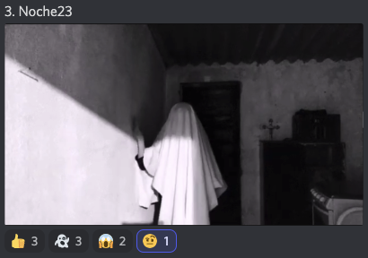  
[07/03](https://discord.com/channels/739208143523020841/769436011981570068/994340127994294332)  
brunoascar: "*otro que apuesta por llevarse el Lav Diaz*";  
braineater23: "*Mirando la luna?*";  
victor_mv23: "*Corto: el eclipse que no fue*";  
Alienigena_Ancestral: "*muy Begotten*";  
JpCortez0: "*A Ghost Story bro*";  
Feo: "*Necesito hablar de ese fantasma, ¿una puta sábana?, ¡métele algo! O sea, un tipo con una sábana puesta parece un perturbado sexual!*";  
guerrerobravo777: "*Antes de la sabana era lo maximo....*";  
AlexWerden: "*Es como Roma con poltergeist, ok*";  
ElDugiJones: "*el fantasma es un ser incorpóreo, que venga caminado impulsando con la pared no me parece una buena decisión de dirección . pero buen corto*"  
.  
.  
- 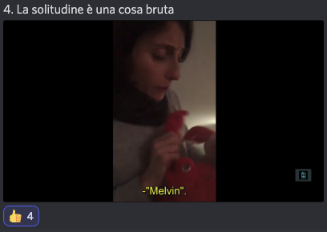  
[07/04](https://discord.com/channels/739208143523020841/769436011981570068/994341722106634281)  
alvaroytalytal [coautor]: "*jajjaja lo grabé yo, pero es una improvisación total*";  
kevin_zahid: "*Contexto quiere una pelota Cuadrada*";  
titokrause: "*es como El chavo del ocho en italiano. la chilindrina italiana*";  
guerrerobravo777: "*Aprendiendo italiani con Alvaro...*";  
ggbyte_: "*questo di pesto papa di mama*";  
xajpot: "*Esto es más triste de lo que parece*";  
juankumz: "*es un plano secuencia y no nos habíamos dado cuenta*";  
Alienigena_Ancestral: "*Neoneoneo realismo italiano*";  
angel_d_hurtado: "*~ G R A N D E ~*";  
charlie_is_omega: "*Este es para darle el premio de Cassavetes*";  
victor_mv23: "*Fellini estaria orgulloso :*"  
.  
.  
- 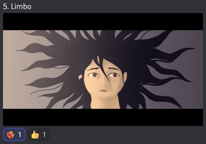  
[07/05](https://discord.com/channels/739208143523020841/769436011981570068/994343294882558052)  
teraquetzal: "*Un útero virgen profanado con la semilla parasitaria deslizante del XenoCristo*";  
maevinler: "*aprended de Buñuel: ni medio pecho y cine hipersexual*";  
DopelOzno: "*una alegoría sobre el duelo?*";  
nachohache1978: "*bru tal*";  
ElPorreteSabrosetee: "*Cómo se puede decir tanto en un minuto?*";  
danielchr20: "*muy corto queriamos mas*";  
satiavan: "*Muy lindo y muy corto*";  
JpCortez0: "*Me corrigen: Animación digital frame by frame??*";  
Ignition: "*No soy bueno resumiendo xD Pero de un chaval que veía seres de otra dimensión.*";  
merlidelagua: "*Que hermoso que estuvo*";  
Feo: "*Bien jugado, esto es un Poyar [obra corta]*";  
ElDugiJones: "*este corto es el bradis la polla*"  
.  
.  

- 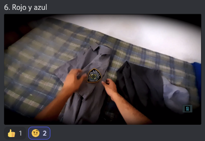  
[07/06](https://discord.com/channels/739208143523020841/769436011981570068/994344903008075796)  
jeff_claude: "*POV: escapa de LATAM*";  
RelatosColapsistas: "*PV-PORN*";  
pegotiao: "*pov te falta un ojo*";  
satiavan: "*Pov ciclope*";  
victor_mv23: "*tiene un ojo debe ser una crítica a la brutalidad policial*";  
xajpot: "*POV eres guerrillero en latam*";  
angel_d_hurtado: "*~ G T A - V I ~*";  
titokrause: "*jajaja... los graficos del gta6 cada vez son más realistas. es por el nuevo engine?*";  
carlaboyera: "*el primer corto subjetivo puede ser?*";  
louli_as_niwas: "*POV sos latino*";  
matuterecomienda: "*La idea no es mala, pero el ritmo narrativo es un problema.*";  
ElDugiJones: "*brutal! felicitaciones strange realitis!!*";  
DjAiiMaR: "*buena idea el quitar los bordes para expresar la vision reducida de la policia*";  
ede_kelgar: "*6/10 me gustan todos los cortos que hagan crítica a la violencia policial.... Mostrar la picha t hubiera dado dos puntos má*"  
.  
.  
- 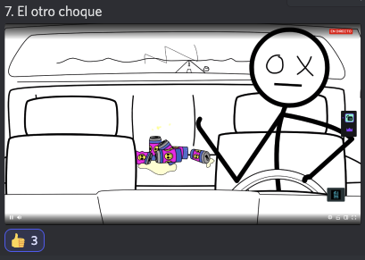  
[07/07](https://discord.com/channels/739208143523020841/769436011981570068/994346450630758480)/[Ver Corto](https://www.youtube.com/watch?v=KzwpCTpLe8U)  
RelatosColapsistas: "*empieza bien la animacion, buen ritmo*";  
scoutconfiebre: "*Tokyo ghul*";  
charlie_is_omega: "*Joder, me ha encantado*";  
Fhauster: "*crash - stickman version*";  
Alienigena_Ancestral: "*jajaja*";  
raysosab: "*love crash*";  
victor_mv23: "*Crash version palitos*";  
titokrause: "*el corto que inspiró a "Crash" de Cronenberg. Muy buena!*";  
xajpot: "*Ay amor divino*";  
satiavan: "*Jaja*";  
lisandroof: "*vin diesel pero realista*";  
DjAiiMaR: "*buenisimo*";  
caracola_9: "*jajjajaja*";  
El_Homi_64: "*10/10 Amor a primer trauma encéfalo craneal*";  
alvarutiscg: "*La mejor historia de romance, no leo fans de Wattpad*";  
charlie_is_omega: "*Masterpiece*";  
bigyonydos: "*solo los que amamos le entendemos*";  
.  
.  
- 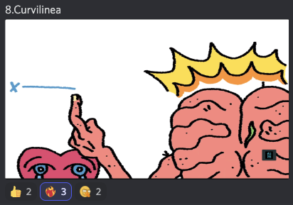  
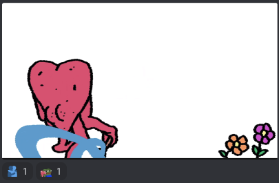  
[07/08](https://discord.com/channels/739208143523020841/769436011981570068/994347175511343154)  
RelatosColapsistas: "*buena animacion tmb este ole*";  
alvarutiscg: "*esta raro, me encanta*";  
ElPorreteSabrosetee: "*Se pasan los animadores tío*";  
caivas: "*muy bueno el estilo*";  
eff_claude: "*Parece capitulo de salad finger*";  
Alienigena_Ancestral: "*Sigue tu mente no tu corazón*";  
mesrup_3: "*estuvo genial*";  
bigyonydos: "*luego por cerrar el cerebro en vez del corazón luego andan llorando porque hice eso*";  
LazSly: "*Jjajaja está chingón*";  
caivas: "*jajajjajajajaj buenisimo*";  
alvarutiscg: "*a banana tuerta de gamp esta bien rara*";  
donatiens: "*buen estilo*";  
charlie_is_omega: "*Ostia, pues el chaval tiene mucho potencial*";  
teraquetzal: "*fue un corazon aprisionando al cerebro o la razon presa de las ganas sentir tu piel*";  
brunoascar: "*no sé cómo expresar lo que ví pero lo entendí*";  
Feo: "*Muy buen historia, eh? La cabeza y el corazón*"  
.  
.  
- 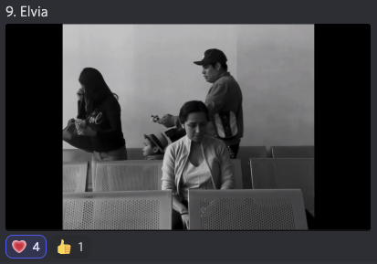  
[07/09](https://discord.com/channels/739208143523020841/769436011981570068/994348121888919573)  
Alienigena_Ancestral: "*4:3 y en blanco y negro=Cine*";  
maevinler: "*siempre un 10 a quienes saben que cieeta profundidad de campo nunca se consigue en color.*";  
teraquetzal: "*buena regulacion de volumenes*";  
guerrerobravo777: "*Se lo tomó en serio*";  
victor_mv23: "*eso lo hizo con un celular??*";  
2oraclos4: "*es el celular de bill gates dejen de ser envidiosos*";  
LulaBeeLula: "*bien actuado*";  
alvarutiscg: "*esta bien chido la fotografia*";  
oziellom99: "*Güeros del maestro Ruizpalacios ♡♡♡*";  
matuterecomienda: "*Dirección 10/10*";  
diegokarasu: "*MUY BUENA ACTUACIÓN (DIA DE LOS MUERTOS)*";  
merlidelagua: "*Me llegó profundo*";  
carlaboyera: "*espectadular*";  
mizraimn: "*Joder muy bueno la verdad*";  
maevinler: "*visualmente, hay TALENTAZO.*";  
crissueldo: "*Muy buena, dirección, fotografía y actuaciones*";  
alvarutiscg: "*Para cuando el premio a Alfonso Cuaron?*";  
maevinler: "*Falta algo de narrativa, pero este tipo sabe rodar. Con un buen guión, lo peta*";  
satiavan [autor]: "*La idea era evocar un poco la nostalgia con el 4/3*";  
satiavan [autor]: "*Y si filmamos con un iphone*";  
satiavan [autor]: "*Con filmic pro banda*"  
.  
.  
- 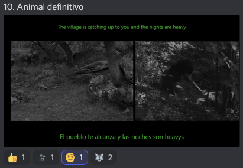  
[07/10](https://discord.com/channels/739208143523020841/769436011981570068/994350406119469149)  
carlaboyera: "*que bien la musica, como marca el ritmo*";  
LulaBeeLula: "*un collage*";  
alvarutiscg: "*Lobos y Heavys*";  
xajpot: "*Llevo el meme de los lobos s otro nivel*";  
maevinler: "*Trabajo fin de curso de comunicación audiovisual*";  
satiavan: "*Buenazo el montaje experimental*";  
kanutonov: "*en tu interior hay dos lobos,uno es esquizofrénico y el otro un alcohólico violento*";  
DjAiiMaR: "*el mito del buen salvaje*";  
bigyonydos: "*creo que esto es lo que me esperaba en un festival de la filmoteca maldita*";  
maevinler: "*Lady Halcón*";  
a_ltgr_: "*eso estuvo salvaje... hay tanto que ver que no sabes donde poner los ojos... encantador*";  
kyubypro: "*herzog y Truffaut*";  
ElDugiJones: "*muy bien hecho. Buena musica, buen texto, buen montaje. Mi única crítica, la tipografía y su color*";  
titokrause: "*textos poéticos y salvajes a la vez*";  
alvarutiscg: "*parece un corto que veria en los videos del feo*";  
juandoge29: "*auuuuuu*";  
Fhauster: "*Temroc version junggle heavy*";  
Rosti_Pollo: "*Es un corto para verlo unas 5 veces, difícil procesar todo de una vez*"  
.  
.  
- 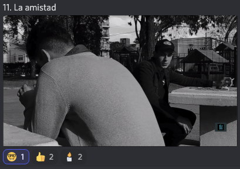  
[07/11](https://discord.com/channels/739208143523020841/769436011981570068/994352434065457153)  
diegokarasu: "*B/N forever*";  
Alienigena_Ancestral: "*argentinoexplotation*";  
guerrerobravo777: "*Chexploitation*";  
rafaelcrz: "*romaexplotation*";  
waltz333: "*Dostoïevskitation*";  
titokrause: "*uwuxplotation*";  
raysosab: "*friendzone*";  
danielchr20: "*ya besense*";  
rafaelcrz: "*vieron buzzlightyear jajaja*";  
xajpot: "*Beso beso beso*";  
Alienigena_Ancestral: "*El corto es sobre el miedo de salir del closet, woke pero no tan woke felicidades*";  
maevinler: "*si le quitas la voz en off lo mismo NO ME SUBE EL AZÚCAR*";  
JpCortez0: "*Si el soundtrack es original, es una joya*";  
alvarutiscg: "*al fin corto LGBT*";  
tormentadelagartos: "*habla sobre la amsitad más alla del tiemp*";  
titokrause: "*el cortometraje que hizo enfurecer a Dross*";  
juan_pronko [autor]: "*perdon por lo cursi jeje*";  
.  
.  

[Volver al índice](../festi.md)