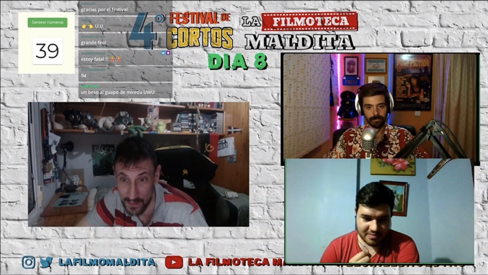
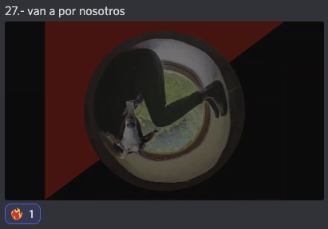
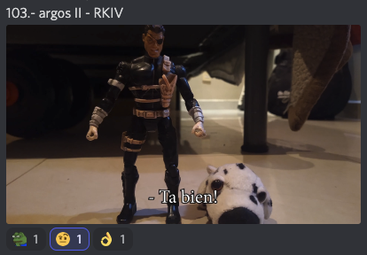
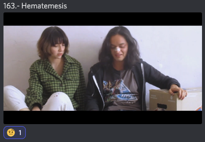
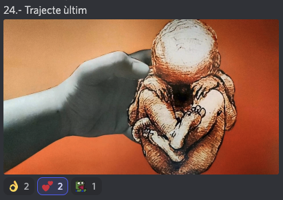
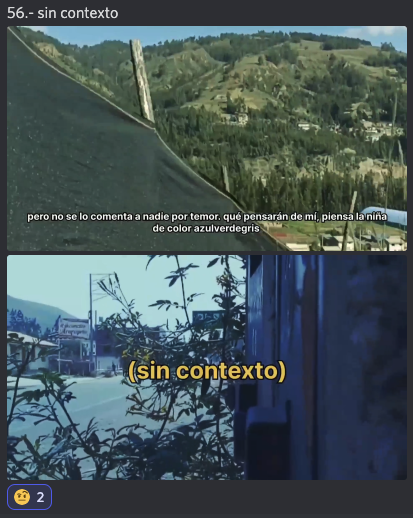
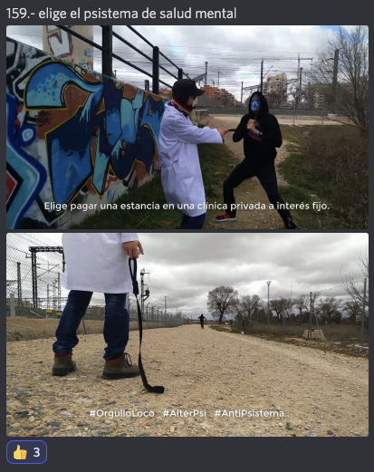
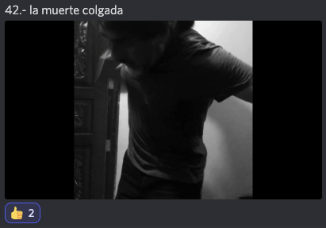
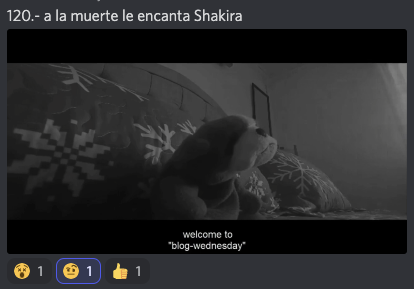
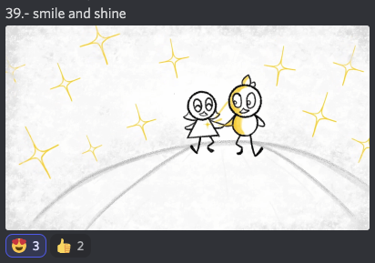

# IV Festival de Cortos de la Filmoteca Maldita 2022
SITIO FANTEAM NO OFICIAL  
[Volver al índice](../festi.md)

## Dia 8 07/07/2022 (Mireda Prod. + Bonfire Tales)

- 1 [27] **Van por nosotros** - Acción DeMente
- 2 [103] **Argos II** - RKIV
- 3 [163] **Hematemesis** - Villanueva Rangel Jesus Orlando
- 4 [46] **Skate dog** - Luis David Cadena Domínguez
- 5 [24] **Trajecte Últim** - Romà Cusí Moreno 
- 6 [56] **Sin contexto** - Leslie Foster
- 7 [159] **Elige el Psistema de salud mental** – Acción DeMente
- 8 [43] **La muerte colgada** - Sol Dominguez
- 9 [120] **A la muerte le encanta Shakira**  – Agustín Araya
- 10 [39] **Smile & Shine** - Javier Madrigal

### Cortos

(Los enlaces llevan al canal de Discord "Chat sin micro")

-   
[08/01](https://discord.com/channels/739208143523020841/769436011981570068/994700012762173531)  
a_ltgr_: "*teo va al siquiatra... jajajajaja*";  
Rebel_Soul_Tech: "*Van a por nosotros*";  
Alienigena_Ancestral: "*Trainspotting*";  
juandoge29: "*hoy nació el anarcocine*";  
kevin_zahid: "*Mencion a la obra mas surrealista*";  
racc00n92: "*accidents polipoetics*";  
juandoge29: "*está muy genial, me da muy buen rollo*";  
shadowceless: "*muy Bueno el Corto la Verdad*";  
hariment: "*21th century schizoid man*";  
lukenivuak: "*Otra vez sin poner en los créditos a los perros!*";  
waltz333: "*A Foucault le gusta el corto*"  
.  
.  
-   
[08/02](https://discord.com/channels/739208143523020841/769436011981570068/994701915445284934)  
alvarutiscg: "*Nick Fury con el perrito*";  
ocincarp: "*esta raro toy story*";  
titokrause: "*La precuela de Toy Story que todo el mundo estaba pidiendo (chúpate esa, dross)*";  
erreka4 [autor]: "*el episodio 1 https://youtu.be/ZiTqqowiYVE*";  
guerrerobravo777: "*Argos, el perro de Odiseo*";  
LulaBeeLula: "*es una fotohistoria*";  
juandoge29: "*si toy story fuera filmado en Iztapalapa*";  
SoundWiburn: "*También la fuente era con serifa y muy poco cuidado en la ortografía.*";  
hariment: "*Los textos pasan a veces demasiado rápidos*";  
ElDugiJones: "*Buena esa animacion del muñeco pero los movimientos de cámara dificultan la lectura del subtitulo bro.*";  
erreka4 [autor]: "*perdón por los subtítulos tan rápidos*"  
.  
.  
-   
[08/03](https://discord.com/channels/739208143523020841/769436011981570068/994704262611353610)  
brunoascar: "*primer easter egg, cartel de psycho*";  
alvarutiscg: "*el arte de la sangre*";  
xajpot: "*Anya Taylor joy Mexicana y un chairo*";  
lukenivuak: "*La waifu del canal*";  
juandoge29: "*alta referencia lo de la caja de huevo XD*";  
brunoascar: "*hizo crecer algo dentro del vato y luego lo extirpo*";  
elgatodeeris: "*homenaje a basket case?*";  
guerrerobravo777: "*"La verganza"*";  
Alienigena_Ancestral: "*Abre la caja!*";  
guerrerobravo777: "*No lo abras!!!*";  
ElDugiJones: "*buena historia, pero tienen que mentir un poco mejor. Se ven mucho los hilos*";  
PosYoKeSe: "*Tiene aspectos destacables y otros por mejorar, va por buen camino*"  
.  
.  
-   
[08/04](https://discord.com/channels/739208143523020841/769436011981570068/994706825654059039)  
lisandroof: "*otro lav diaz?*";  
racc00n92: "*lords of dogtown*";  
brunoascar: "*y los perros?*";  
raysosab: "*dogploitation*";  
rafaelcrz: "*me recordó a youtube en 2008*";  
juandoge29: "*dogs in the 80's*";  
trapitoide: "*donde esta el conflicto dramatico?*";  
anjasaro: "*perro patineto*";  
animaciones96: "*nos trolleo*"  
.  
.  
-   
[08/05](https://discord.com/channels/739208143523020841/769436011981570068/994707556436037642)  
nachohache1978: "*me encanta*";  
r4f24el: "*corto provida?*";  
ElPorreteSabrosetee: "*Provida o antinatalista?*";  
xajpot: "*chopin god 🧐*";  
paul38104: "*es ingeniero*";  
juandoge29: "*mejor animación seguro*";  
lisandroof: "*estilo monty python*";  
S_Fita: "*Rollo Terry Gilliam, tb rollo Dave McKean*";  
rickkkk_sm: "*viejo, que gozo con este corto*";  
JpCortez0: "*Bldo es un stopmotion collage! Qué joya!*";  
mandacarallo2: "*a mí me recuerda a Pink Floyd*";  
rickkkk_sm: "*feo, minimo le das un premio a mejor diseño*";  
chekolatte: "*ME RECUERDA EN ESTILO UN TANTO A WALERIAN BOROWCZYK*";  
Alienigena_Ancestral: "*O al estilo del um checo que se llama mas o menos Bolaj o algo asi*"  
.  
.  
-   
[08/06](https://discord.com/channels/739208143523020841/769436011981570068/994709576219889664)  
ocincarp: "*esperaba todo menos al feo*";  
anjasaro: "*hasta salió el feo*";  
alvarutiscg: "*Hay el feo salio, cameo GOD*";  
juandoge29: "*la cuarta pared*";  
LucyFer_v: "*bueno, no entendí, sin contexto*";  
emmanuelelele: "*contexto, es un stalker*";  
lukenivuak: "*Creo que este corto ganaría mucho más con narración en lugar de texto.*";  
JpCortez0: "*No sé, los cortos tan metafóricos, si no conoces el contexto, no entiendes un carajo..*";  
KaramazovXIX: "*En el siguiente festival, Paul hará un corto después de ser friendzoneado*";  
pabloalcosta: "*un intento de corto, segun el autor. Un corto honesto XD*";  
juandoge29: "*masculinidad frágil del Pol*"  
.  
.  
-   
[08/07](https://discord.com/channels/739208143523020841/769436011981570068/994711923964788746)  
S_Fita: "*Buenísima Acción Mutante*";  
a_ltgr_: "*transpotingxlopation*";  
trapitoide: "*outlast 3*";  
acevedo26: "*Nada original, pero bien realizado...*";  
anjasaro: "*Hay locos que locos nacen, hay locos que locos son. Hay locos que vuelven locos, a los que locos no son. Hay locos por el dinero y hay locos por el amor. Pero si yo me hago el loco, paso la vida mejor*";  
nachohache1978: Quiero un enlace de este corto YA*";  
alvarutiscg: criticando las medicinas wow*";  
merlidelagua: "*La mierda de las farmeceuticas*";  
donatiens: "*si... translado del manicomio a los farmacos*";  
trinex333: "*me encantó el mensaje pero es un videoclip*";  
guerrerobravo777: "*Ibuprofeno + Paracetamol + Omeprazol, la santisima trinidad de la medicacion publica*"  
.  
.  
-   
[08/08](https://discord.com/channels/739208143523020841/769436011981570068/994713996533956708)  
Titokrause: "*esta muy bien la idea.*";  
lisandroof: "*está narrando la muerte?*";  
guerrerobravo777: "*Parece un video de "Enchufe TV"*";  
s_y_n_g_o: "*que maja la parca : 3*";  
Bonfire: "*Buena comedia, buena interpretación de voz"*";  
mandacarallo2: "*Qué bueno!!*";  
alvarutiscg: "*me gusto mucho*";  
mandacarallo2: "*La voz de la mujer es fantástica!!*";  
KaramazovXIX: "*Qué sádico*";  
jorgericardo2004: "*denle un oscar al muerto*";  
nachohache1978: "*este va a por el chicho Ibáñez eh? buen remate*";  
rojo_absurdo: "*buenisimo, yo le daría un premio*";  
Feo: "*Muy bien, creó curiosidad y lo fue desarrollando"*"  
.  
.  
-   
[08/09](https://discord.com/channels/739208143523020841/769436011981570068/994715494370267217)  
alberthans1: "*muerte, locura y perros*";  
alvarutiscg: "*pasen el canal del perrito*";  
LucyFer_v: "*Sargento canela mejor youtuber*";  
trapitoide: "*mira ese contrapicado papaaa*";  
victor_mv23: "*Que alguien pase el link del canal del Perro*";  
anjasaro: "*el sindrome de dogdar*";  
afercu: "*Para morir hay que perder la vida. ~yo*"  
anjasaro: "*Whenever, Wherever*";  
nachohache1978: "*me meo toaaaa xD y además entona. Que me como al perrete jajajaja*";  
asmodeo_pendragon: "*Sr Whis?*";  
al_g_narvaez: "*el episodio prohibido de 31 minutos*";  
Mireda: "*Hoy la temática ha sido perros y salud mental... buena idea pero un poco más corto*"  
.  
.  
-   
[08/10](https://discord.com/channels/739208143523020841/769436011981570068/994718277253222500)  
jorgericardo2004: "*mi bebito fiu fiu*";  
lisandroof: "*es que me derrito de la ternura*";  
donatiens: "*arriba los pumas!!*";  
anjasaro: "*tiernito :3*";  
alvarutiscg: "*pollo cuck*";  
LazSly: "*relaciones toxicas?*";  
KaramazovXIX: "*Me identifico con este corto. 10/10*";  
DopelOzno: "*inspirado en la historia de los 13 mil varos del diefuan*";  
shadowceless: "*quiero abrazarlo*";  
PrivateTaylor: "*el llamado a la aventura*";  
louli_as_niwas: "*TREMENDA LA ANIMACIÓN*";  
Alienigena_Ancestral: "*el sonido está exelente*";  
louli_as_niwas: "*10/10 lloré*";  
lackregular: "*que bonito*";  
jorgericardo2004: "*eso no era un pinguino xd*";  
shadowceless: "*me hizo acordar a mi primer duelo, Quiero abacharlo al bichito del cortito*"  
.  
.  

[Volver al índice](../festi.md)