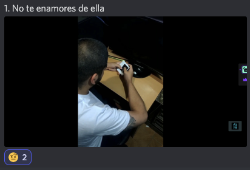
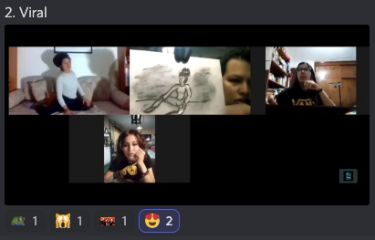
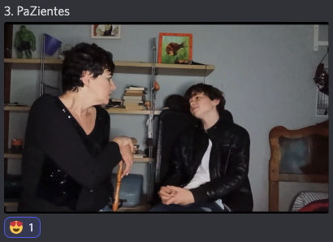
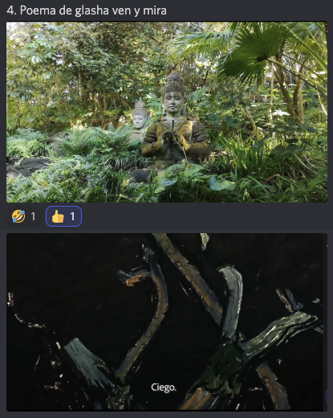
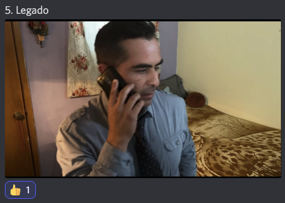
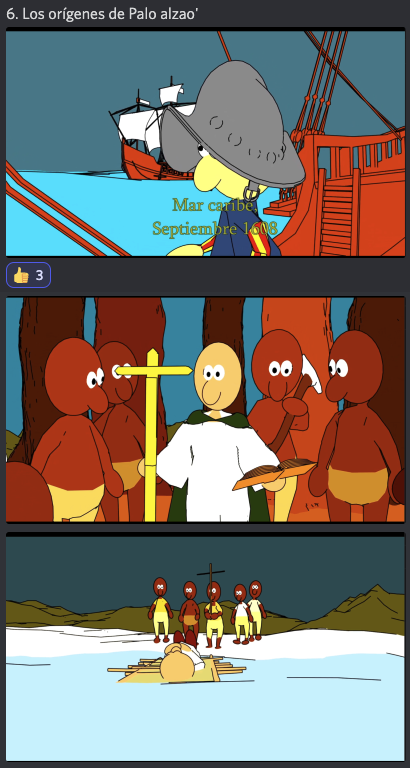
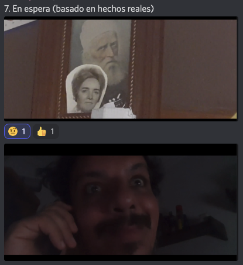
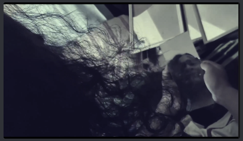
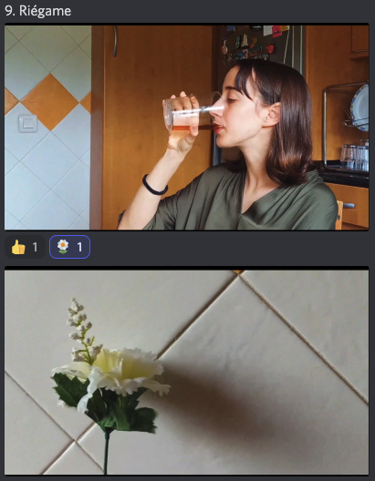
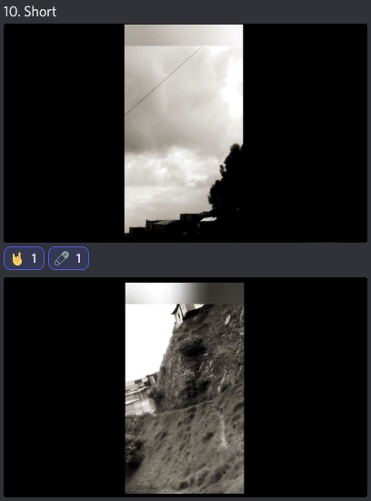

# IV Festival de Cortos de la Filmoteca Maldita 2022
SITIO FANTEAM NO OFICIAL  
[Volver al índice](../festi.md)

## Dia 9 08/07/2022 (Maxi Contenti)

- 1 [34] **No te enamores de ella** - Mario Ivan Avila Romero
- 2 [70] **Viral** -  Ika Gozrodze
- 3 [76] **PaZientes** - Bruno Bellas Mored
- 4 **Poema de glasha ven y mira**
- 5 **Legado**
- 6 [28] **Los Origenes de Palo Alzado** - Strange Realities
- 7 [44] **En espera (Basado en Hechos reales)** - IGNACIO HERNAEZ SANMARTÍN
- 8 [80] **La Cosa Nostra** - Ale Arroyo
- 9 [82] **Riégame** - Devoz al Alba
- 10 [29] **Short** - Julián Vanegas

### Cortos

(Los enlaces llevan al canal de Discord "Chat sin micro")

-   
[09/01](https://discord.com/channels/739208143523020841/769436011981570068/995063380450746519)  
r4f24el: "*momento fuckboy*";  
maevinler: "*en vertical, generación Z wannabe*";  
morfosaurus: "*sadboy*";  
guerrerobravo777: "*Azucar amargo...*";  
AlexWerden: "*masculinidad herida, en toda la salsa de esta edicion +1*";  
juanesarenas24: "*empezamos con la masculinidad frágil*";  
r4f24el: "*poético 🚬*";  
juanitoooo_1: "*deconstruidoo*";  
carlaboyera: "*se tiro unas barras*";  
Maxi: "*Es muy poético. Muy interesante. ¡Bien!*";  
Feo: "Es difícil grabar de noche y que no quede castaña*"  
.  
.  
-   
[09/02](https://discord.com/channels/739208143523020841/769436011981570068/995064911573045248)  
ElDugiJones: "*una carta de amor a nosferatu*";  
guerrerobravo777: "*UNFRIENDED!!!*";  
maevinler: "*Creepypasta.*";  
paul38104: "*es el ayuwoki*";  
LulaBeeLula: "*la garra!*";  
malaquita08: "*hay una peli así del 2020*";  
tormentadelagartos: "*geniaaal*";  
0scar6omez: "*las sombras se sintieron muy artificiales. El hecho del punto de vista de webcam le daba para hacer sombras con personas fuera de cámara más naturales*";  
xajpot: "*Ugly me orine del susto*";  
Maxi: "*Es Host en corto...*";  
a_ltgr_: "*si, muy Host*";  
AlexWerden: "*si, era ingenioso y no da para mas en tan pocos minutos*"  
.  
.  
-   
[09/03](https://discord.com/channels/739208143523020841/769436011981570068/995066279834697738)  
titokrause: "*coñe. tenemos un futuro actor..*";  
santiago_yudait: "*ig de la veterana*";  
rickkkk_sm: "*soy la polla*";  
racc00n92: "*soy la polla*";  
El_Homi_64: "*Se puede decir que este corto es la polla?*";  
juanitoooo_1: "*vamo a ver, es malo. pero toda la buena onda que le ponen la recontra salva*";  
geras290: "*me gusta como han cooperado para realizarlo*";  
reinade_loslagartos01: "*es feo como el feo pero lindo como el feo*";  
elgatodeeris: "*bueno, hay cosas de Bruno Moatei que son bien peores*";  
carlaboyera: "*a mi me esta encantando*";  
maevinler: "*Elliot Page lo mejor*";  
marvin90kp: "*Tsylor Hargraves se arto de sus hermanos y actuo en este corto*";  
alonso4666: "*Zombiland reference*";  
alvaroytalytal: "*tiene enjundia, escena de tiros, guión imaginativo*";  
a_ltgr_: "*tiene un buen manejo del lenguaje cinematografico, el montaje es bastante decente, tiene hasta bien metidos los efectos de audio. Tiene mucho ingenio*";  
Feo: "*Lo ha hecho un chaval de 13 años. ¡Sigue haciendo cine!*"  
.  
.  
-   
[09/04](https://discord.com/channels/739208143523020841/769436011981570068/995069208763301978)  
brunoascar: "*alguien sabe si existe el poema de glasha?*";  
ElDugiJones: "*está filmado con el movil de dios*";  
titokrause: "*tarkovsky conociendo a Terrance Malick*";  
vladimirmaineros [¿autor?]: "*esta grabado con Huawei, y filmic pro*";  
KaramazovXIX: "*Muy pro. Me ha molao*";  
papeco556: "*O si pondre cosas sin sentido en VOZ EN OFF SIII ES CINEEE*";  
guerrerobravo777: "*Es Peri Mental...*";  
carlaboyera: "*la fuerza del texto*";  
a_ltgr_: "*anotado para mejor ambientacion*";  
maevinler: "*No ha defraudado. Eso es cierto.*";  
alberthans1: "*me gustó estuvo bueno y los sub no chocaron con el corto*";  
titokrause: "*a mi me ha gustado! de diez el montaje!*"  
.  
.  
-   
[09/05](https://discord.com/channels/739208143523020841/769436011981570068/995070482548273192)  
alberthans1: "*hay que ir al cumpleaños del abuelo*";  
kanutonov: "*muy madre esa madre*";  
s_y_n_g_o: "*creíble la conversación*";  
titokrause: "*bastante realista la conversación . y eso que suele ser dificil hacerlas bien.*";  
mrcualquieras: "*parece novela de la tarde*";  
brunoascar: "*es eclfriendly*";  
racc00n92: "*la rosa de guadalupe edit*";  
rickkkk_sm: "*el audio está bien cuidado, hay que reconocerlo*";  
marvin90kp: "*este parece comercial d banco ¡¡no jodan!!*";  
jessyold2000: "*esto lo hizo televisa? XD*";  
apoloz18: "*valorar siempre al que valor te inculcó... buen corto*";  
al_g_narvaez: "*La rosa de Guadalupe hecha por gente con alma*";  
nachohache1978: "*qué buena se puso la novela*";  
Feo: "*Igual faltaba un poco de coherencia en quien era el protagonista y qué estaba contando.*";  
Maxi: "*Me gustó mucho el angular. La foto usando foco en todos lados. Me gustó cómo estaba filmado y grabado.*"  
.  
.  
-   
[09/06](https://discord.com/channels/739208143523020841/769436011981570068/995073027312201818)  
ggbyte_: "*ou mama*";  
racc00n92: "*prendele mecha*";  
diegokarasu: "*arranque brutal*";  
alberthans1: "*en los años 1600 tum tum tum*";  
racc00n92: "*feo devuelve el oro*";  
el_gf: "*devuelve el oro, el juego*";  
PrivateTaylor: "*muy buena narración*";  
titokrause: "*tio que buena la banda sonora*";  
r4f24el: "*bravo*";  
xajpot: "*👏👏👏👏*";  
mizraimn: "*Buenísimo*";  
carlaboyera: "*de 10*";  
s_y_n_g_o: "*APA*";  
waltz333: "*bravo*";  
oziellom99: "*este men ya es pro*";  
a_ltgr_: "*brutal la animacion, el trabajo en color, la narración... todo bien*";  
juanitoooo_1: "*rotoscopia, 3d o ambas?*";  
maevinler: "*Ernesto Sevilla de Narrador MÁS 10*";  
LulaBeeLula: "*no conocía la historia, gracias*";  
Feo: "*mis dieces!*"  
.  
.  
-   
[09/07](https://discord.com/channels/739208143523020841/769436011981570068/995075185914957824)  
rafaelcrz: "*amigos de la comunidad de La filmoteca es necesario hacer un grupo de terapia, ya son varios cortos que son cartas de auxilio*";  
Nekro_Vlad: "*banda ya me traume*";  
louli_as_niwas: "*psicólogo urgente*";  
a9a9aa99: "*Cómo dar miedo con pocos recursos se debería de titular*";  
racc00n92: "*Espantando viejas el corto*";  
Alienigena_Ancestral: "*inspirado en la mitad de los seguidores de Dalas*";  
KaramazovXIX: "*Lav Díaz ya*";  
rickkkk_sm: "*El corto estuvo bien elaborado pero es bastante incomodo, no sé que decir*";  
maevinler: "*¿se puede denunciar al autor de este corto en España?*";  
mizraimn: "*Como dar Cringe con pocos recursos más bien*";  
maevinler: "*Este hombre me ha hecho daño al alma*";  
nachohache1978 [autor]: "*una espera de amor... amé trabajar con Paco León y Ernesto Alterio eso es cierto; xD las fotos son mi madre y mi abuela que les pedía ayuda para conseguir trabajo en cine porque realmente cuento mi historia hasta que lo consigo y lo logré xD; se que no ganaré nada fue divertido esta primera vez 😅*";  
titokrause: "*El argumento del corto es sobre la desesperación de un actor por recibir una llamada. Si no te llaman , no curras. por eso lo de la foto del final, en plan pose de casting.*";  
fede_kelgar:"*me dió miedo.... eso es seguro*";  
el_gf: "*era un tiktoker tercermundista*";  
alvaroytalytal: "*la desesperación de un narciso?*";  
alberthans1: "*hay que armar un grupo de autoayuda*"  
.  
.  
-   
  
[09/08](https://discord.com/channels/739208143523020841/769436011981570068/995077247994171474)  
fervfervferv: "*wow genial*";  
racc00n92: "*el trastorno de personalidad multiple*";  
maevinler: "*Esto es un documental. Esa persona vive así*";  
Alienigena_Ancestral: "*ojo el juego de fotografía*";  
maevinler: "*ERROL MORRIS, VEN Y RUEDA*";  
raysosab: "*tiene 32 personalidades*";  
xajpot: "*TID*";  
alonso4666: "*Fragmentado?*";  
titokrause: "*'Multiple' de Shyamalan version Latam*";  
rojo_absurdo: "*lo que tiene el arte es que es catarquico*";  
xajpot: "*Si moon Knight fuera buena*";  
ElDugiJones: "*premio a mejores vestuarios*";  
xajpot: "*REVIVIÓ EL CINE Y EL TID kbrones 🚬🚬🚬*";  
maevinler: "*Steam Manu Chao Punk*";  
rojo_absurdo: "*te mete en la historia*";  
a_ltgr_: "*me encanta, el dialogo entre diferentes personalidades y la ambientacion diferente para cada uno de ellos. Muy inteligente*";  
kanutonov: "*muy fino,mantiene bien la expectación,buena música,actuación...olé*";  
asmodeo_pendragon: "*SI ES CINE*"  
.  
.  
-   
[09/09](https://discord.com/channels/739208143523020841/769436011981570068/995079626126807170)  
s_y_n_g_o: "*(^_^)/*";  
kronokrypta: "*ig de la flor*";  
carlaboyera: "*la segunda parte de mi corto*";  
emmanuelelele: "*no plantita, azuca no :c*";  
victor_mv23: "*no plantita piensa en tu diabetes*";  
fede_kelgar: "*todos somos adictos al azucar, hay qptarlo*";  
titokrause: "*buena musiquilla del paseo*";  
PrivateTaylor: "*buena actuación la de la planta*";  
fede_kelgar: "*Cuando pida falopa hay que podarla*";  
racc00n92: "*me recordó a obedece a la morsa*";  
elpseudoesteta: "*creo que faltaba desarrollar más el concepto. me hubiera gustado ver más como sigue la evolución de la planta. los planos son bastante funcionales.*";  
Feo: "*De los pocos cortos que no tienen enfermedades...*";  
KidPochoclo: "*no se si no tiene enfermedades, le hablaba a la planta*";  
Alienigena_Ancestral: "*muy buenos planos holandeses esos planos sen difíciles de hacer pero les quedó bien*";  
ElDugiJones: "*buena banda sonora, pero me resultaron medio incomodos los zoom que hace*";  
mizraimn: "*pero bueno el mensaje de que el azúcar te lleva a peores drogas*";  
kamayisuskan: "*Creo que la planta es la representación de las adicciones, que parecen ser dulces y amigables pero cada vez piden más y más, hasta que nos destruyen, por lo que ese corto es cine*"  
.  
.  
-   
[09/10](https://discord.com/channels/739208143523020841/769436011981570068/995081588922650704)  
xajpot: " :( :( :( :( :( :( ";  
LulaBeeLula: "*steady cam !*";  
kanutonov: "*doomer*";  
r4f24el: "*desmotivaciónes*";  
PrivateTaylor: "*surrealismo puro*";  
victor_mv23: "*el neorealismo latinoamericano dice presente en este festival*";  
aguscamus: "*un poco tirado de los pelos, claramente, no hay mensaje, sino sensaciones encontradas*";  
fede_kelgar: "*Se ató la camara al pelo y salió a caminar*";  
KidPochoclo: "*la música no me digusta, va con el corto*";  
juanitoooo_1: "*es que esas distorciones y la monotonia tienen su encanto,  medio post punk*";  
el_gf: "*cuanta decadencia*";  
titokrause: "*es rock noise. mola*";  
mizraimn: "*Muy postmoderno, en Antimensaje el no querer transmitir nada*";  
ggbyte_: "*suena como manolo cabezabolo mas desganado que nunca*";  
Alienigena_Ancestral: "*Les explico es el recorrido lejano que hace desde su casa por eso irónicamente se llama "short", porque es largo y tedioso*";  
travis_jazz: "*Ni el tipo shoenberg se habia atrevido con tanto dodecafonismo*";  
mizraimn: "*Ya denle el Lav Días*";  
kanutonov: "*lav díaz es tarantino comparado con este tío*";  
elpseudoesteta: "*no es Fluxus no?*";  
Feo: "*el postmodernismo tiene mas ideologia*";  
emmanuelelele: "*No se si vi un corto o la peli de 7 horas de warhol*"  
.  
.  
-   
[Volver al índice](../festi.md)