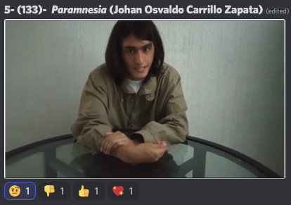

# IV Festival de Cortos de la Filmoteca Maldita 2022
SITIO FANTEAM NO OFICIAL  
[Volver al índice](../festi.md)

## Dia 10 09/07/2022 (LulaBeeLula)
   .
-   
-   
-   
-   
-   
-   
-   
-   
-   
-   
-   

### Cortos

(Los enlaces llevan al canal de Discord "Chat sin micro")

-   
[10/01](https://discord.com/channels/739208143523020841/769436011981570068/995422962138230825)  
el_gf: "*que onda esa ventana en diagonal*";  
AlexWerden: "*arg, ventanas de diseño mal*";  
alvarutiscg: "*stalker is that you?*";  
juandoge29: "*la locación está re bien cuidada*";  
rickkkk_sm: "*plano secuencia*";  
titokrause: "*si, plano secuencia y buena precencia de la actriz. y con ASMR incluido. nada mal!*";  
fede_kelgar: "*El que respira es el mismo que espiaba a Gelga Pataki de Hey Arnold*";  
alvarutiscg: "*Me recordo a Halloween de Carpenter pero le falta pullirla mas con el fin de que de mas miedo o que las sombras no sean tan notorias porque casi ni se ve nada*";  
guerrerobravo777: "*El corto que no entendió Scorsese...*";  
anjasaro: "*pudo haber sido de menor duración*";  
Lula: "*Es importante el espacio auditivo. Acá le hace falta un poco de efectos sonoros que acompañe la acción del personaje...*";  
Alienigena_Ancestral: "*El problema es el montaje interno que le faltó ritmo*";  
edvardo_96: "*7/10. me gusta el suspenso. Pero técnicamente, falta mejorar varias cosas, aun así la ambientación también ayudó a la atmósfera.*";  
Feo: "*Los silencios pueden funcionar pero si abusas pierden el efecto... habría que sintetizar un poco"  
.  
.  
-   
  
[10/02](https://discord.com/channels/739208143523020841/769436011981570068/995425959886979173)  
cecilkutsi: "*fuaaa!! como le pega al techado!!*";  
r4f24el: "*blanco y negro 🚬*";  
rafaelcrz:"*otro grito de ayuda peña, lo del club de terapia ya no es una broma*";  
juandoge29: "*que que bonita fotografía*";  
fede_kelgar: "*Muy excéntrico*";  
yizuxzz: "*Cosas a mejorar, mezcla de sonido con un poco de tiempo en audacity pudo mejorar más*";  
rickkkk_sm: "*feo, abre un canal sobre terapia psicológica*";  
maevinler: "*Vaya por Dios. BUKOWSKI WANNABE*";  
rojo_absurdo: "*fumar porro de madrugada solo, es un viaje a los infiernos*";  
cecilkutsi: "*estoy mal, que hago? un corto o un school shooting??*";  
kanutonov: "*gaspar noe*";  
alvarutiscg: "*asi termino Requiem de un sueño*";  
titokrause: "*쯈ué es masculinidad fragil? Muy sencillo: Lo que el chat dice que es masculinidad fragil, ES masculinidad fragil.*";  
fede_kelgar: "*Hay un poco de ''El Aro'' o ''La llamada'' en este corto*";  
maevinler: "*쯉oy el único llorando en posición fetal?*";  
PrivateTaylor: "*premio al mejor travelling*";  
anjasaro: "*ganó el premio costa gavras*";  
cecilkutsi: "*tecnicamente es genial, pero metele historia*"  
.  
.  
-   
  
[10/03]()  
alonso4666: "*Somos el espejo?*";  
paul38104: "*POV: estas espiando a un jugador de lol*";  
yizuxzz: "*Momento gamer, te preparas como si fueras a salir y vuelves a sentarte 8 horas en la computadora*";  
DopelOzno: "*incómodo porque es un reflejo de mi vida*";  
DjAiiMaR: "*el show de truman*";  
maevinler: "*Esto aburre a Julio Medem*";  
PrivateTaylor: "*ReleaseTheSnyderCut*";  
rafaelcrz: "*este chat viendo se asi mismos en un corto vaya 4ta pared*";  
2oraclos4: "*fallo el audio, aun asi el corto estaba bueno*";  
anjasaro: "*ganó el premio pat belatar*";  
mandacarallo2: "*Ya te digo !! Saudade y morriña del tiempo que no volverá !!*";  
KaramazovXIX: "*Entiendo la idea, pero le faltó hacerla más interesante*";  
louli_as_niwas: "*Gabriel sos un capo*";  
edvardo_96: "*se me hizo largo, pero es sincero y tiene buenas itenciones pero falta mejorar la actuación y la dicción*"  
.  
.  
-   
[10/04](https://discord.com/channels/739208143523020841/769436011981570068/995432227288649828)  
elpseudogamer: "*que buena animación por dios*";  
a_ltgr_: "*brutal... muy animacion francesa*";  
satiavan: "*Buena calidad de animación 👌*";  
juandoge29: "*se parece de Echeverría*";  
guerrerobravo777: "*Slenderman*";  
anjasaro: "*comprando salvación?*";  
Alienigena_Ancestral: "*los planos aberrantes están perfectos*";  
AlexWerden: "*joe, q ganas de meterme un evangelio ahora q estoy de bajona, bro*";  
elpseudogamer: "*el opio del pueblo es la iglesia*";  
ggbyte_: "*vamos a meternos unos versiculos*";  
lukenivuak: "*Ya ganó!*";  
Zkualid: "*Guapísimo*";  
brianpipe: "*increible*";  
KaramazovXIX: "*MI ANIMACIÓN FAVORITA EN LO QUE VA DE FESTIVAL. QUÉ PASADA.*";  
s_y_n_g_o: "*mortallll*";  
jeantonioni: "*increíble, felicidades!*";  
edvardo_96: "*ufffff 9/10 increible metáfora es directa y la animación te transporta*"  
.  
.  
-   
[10/05](https://discord.com/channels/739208143523020841/769436011981570068/995433707483701321)  
PrivateTaylor: "*Arthur Fleck*";  
Alienigena_Ancestral: "*Actuación de metodo Rosaguadalupano clásica*";  
colacao_con_vodka: "*la actuación me mola!*";  
yizuxzz: "*Necesito más emoción en esa voz neta*";  
virtuosantly: "*Buena dicción, audio *";  
juandoge29: "*día normal en Tijuana*";  
DopelOzno: "*el monologo está bien perole falta fuerza a la voz*";  
silverknight3: "*va bien la historia, interesante*";  
maevinler: "*Muy grunge todo. Pero esto no es cine, es un poema ilustrado con imágenes*";  
comemurcielagos: "*creo que es más un cuento que un corto*";  
anjasaro: l"*iminal spaces*";  
hariment: "*Otro Bukowski*";  
elpseudogamer: "*mmm como el cine de fotos frances*";  
rafaelcrz: "*una historia de... LA RATA CON THINNER y mas cuentos latinoamericanos*";  
lucas_serafini_boixados: "*hoy ganó la literatura*";  
johanzapp [쯔utor?]: "*No habia presupuesto y cortamos demasiadas cosas. Originalmente duraba 15 min*";  
elpseudogamer: "*la jetee tenia mas estilo*";  
johanzapp [쯔utor?]: "*El cuento se ubica en el futuro, el vato mata a la morra porque es un robot*"  
.  
.  
-   
[10/06](https://discord.com/channels/739208143523020841/769436011981570068/995438208508776468)  
silverknight3: "*muy cordovez xd*";  
elpseudogamer: "*uy se ve la adoctrinacion desde la primer institución, la familia*";  
rickkkk_sm: "*muy bettercallsaul*";  
mizraimn: "*mira es Breaking Bad*";  
ggbyte_: "*es el heisebeng latino*";  
eldelfin_rosad0: "*metastasis*";  
elpseudogamer: "*por lo menos este corto si tiene lo básico, conflicto*";  
rickkkk_sm: "*Metastasis el corto*";  
el_gf: "*cuidado, tony soprano??*";  
Yulis: "*El Walter White Argento loco*";  
maevinler: "*Enorme ELIPSES. BREAKING BAD*";  
racc00n92: "*buen efecto de sonido y plano*";  
silverknight3: "*wtf ese final muy repentino*";  
fede_kelgar: "*Es Córdoba argentina... Los cordobeses tienen un acento así*";  
maevinler: "*no ha durado mucho, algunos planos buenos. El actor de la pistola impresionante*";  
edvardo_96: "*6/10 buena idea, pero el torturado actúa mal y se pierde la emoción de la escena, chica pero ok*";  
yizuxzz: "*Pues ta okey 6/10*"  
.  
.  
-   
[10/07](https://discord.com/channels/739208143523020841/769436011981570068/995439950638104637) [Ver Video](https://www.youtube.com/watch?v=Z1EULs1djRE)  
alonso4666: "*OTRO PODCAST?*";  
PrivateTaylor: "*tiene pinta de anuncio*";  
guerrerobravo777: "*Un Texting....Plop!!*";  
gombowombo: "*que es esto*";  
elmaecr2: "*otro Powerpoint ...*";  
elpseudogamer: "*nooo, corto existencialistaaa, me van a dar ganas de automoririme*";  
MythicHalWorld: "*no veo na ta borroso*";  
rickkkk_sm: "*para el proximo festival dejen de hacer podcast*";  
rafaelcrz: "*te falto un poco mas de comunicar con imagenes y no con texto*";  
alvaroytalytal: "*es un ordenadornonasí*";  
juandoge29: "*lpm el protagonista es un computador*";  
angel_d_hurtado: "*zZ zZ zZ*";  
maevinler: "*OTRO DE BAJONA. Primer festival Shopenhauer de la Filmoteca Maldita.*";  
AlexWerden: "*Skynet, origins*";  
SkrotoDesatado: "*T_D_S P_T_S*";  
comemurcielagos: "*mmm bien narrado y la musica bien, pero de corto poco diría*";  
ggbyte_: "*esta bien pero le falta punch*";  
a9a9aa99: "*Me gustó porque duró poquito*";  
Alienigena_Ancestral: "*Hampartismo*";  
AlexWerden: "*ha sido un poco mierder, si hay confianza con él pa decirlo. tranqui Lula*";  
MythicHalWorld: "*el glitch se volvio canon*"  
.  
.  
-   
[10/08](https://discord.com/channels/739208143523020841/769436011981570068/995442330238730292)  
gombowombo: "*este pinta muy potente, buena atmósfera*";  
silverknight3: "*pues el sonido va bien pero me dan miedo los diseños xd*";  
anjasaro: "*as cerraduras del duat, el inframundo egipcio*";  
ggbyte_: "*aqui hay mandanga*";  
danielpardes123: "*joder, es cine*";  
guerrerobravo777: "*El cancerbero*";  
elgatodeeris: "*mitología egipcia en plastilina la leche....*";  
hariment: "*Es Anubis*";  
elpseudogamer: "*le hizo un residen ivol*";  
a_ltgr_: "*muy bueno*";  
racc00n92: "*buenardo*";  
KaramazovXIX: "*Me flipa esta mierda. Le faltaron más frames, pero me ha gustado.*";  
fede_kelgar: "*9/10 me gusto la referencia egipcia*";  
2oraclos4: "*el corazon pesaba mas que la pluma de osiris?*";  
mandacarallo2: "*Está bien!! Se agradece !!*";  
edvardo_96: "*muy bueno 8/10 la escena con las sombras muy cuidada, claymation hecho con detalles muy apreciables*"  
xajpot: "*Felicidades al que hizo el corto*"  
.  
.  
-   
[10/09](https://discord.com/channels/739208143523020841/769436011981570068/995444274671923301)  
PrivateTaylor: "*nouvelle vague*";  
satiavan: "*Puesta en camara, tiene propuesta 👍*";  
Alienigena_Ancestral: "*Ojo con el montaje*";  
juandoge29: "*que buenos actores los señores*";  
guerrerobravo777: "*La tigresa del orient...*";  
transmetal0480: "*¡cómo quiere escribir sin leer nada?*";  
mizraimn: "*joder se viene psicokiler*";  
elmaecr2: "*buena música*";  
PrivateTaylor: "*eyes wide shut latinoamérica*";  
anjasaro: "*They live (a la menos uno)*";  
waltz333: "*La purga latam*";  
maevinler: "*Con lo bien que iba el corto... La Noche de las Bestias.*";  
titokrause: "*buena producción eh*";  
racc00n92: "*buena composicion, los cambios de plano*";  
elpseudogamer: "*revivan a kubrick para que vean esta obra de arte*";  
Rebel_Soul_Tech: "*Este esta muy bien llevado en cuestion de ritmo suspense*"  
.  
.  
-   
[10/10](https://discord.com/channels/739208143523020841/769436011981570068/995447288002523216)  
anjasaro: "*aguante el tonglish*";  
r4f24el: "*aguante KineMaster*";  
eldelfin_rosad0: "*tongo vibes*";  
ggbyte_: "*ojo que se han hecho un videoclip*";  
elmaecr2: "*post-punk?*";  
rickkkk_sm: "*terrible videoclip de los prisioneros indie wave folk tiktok lyrics*";  
alvarutiscg: "*ya salio el dinopeluche*";  
PrivateTaylor: "*videoclip noventero*";  
eldelfin_rosad0: "*post punk peruano*";  
AlexWerden: "*un videoclip en 4:3 como si fuera de VHS peña- q eso es meritorio*";  
KaramazovXIX: "*Me recordó un poco a la intro de Malcolm también*";  
raysosab: "*estética de principios de los noventa*";  
guerrerobravo777: "*MTV en su etapa de decadencia....*";  
titokrause: "*volví a mi adolescencia de la MTV *";  
hariment: "*Parece un video de eskorbuto pero peor*";  
gargola712: "*Ska dog 2*";  
anjasaro: "*adventura island*";  
danielpardes123: "*So can I call you tonight?*";  
DopelOzno: "*can i call you tonight si hubiera sido hecho en chiapas*";  
titokrause: "*#StopMTVExplotation*";  
fede_kelgar: "*Mis dieses para esta banda under que intenta hacerse conocer por cualquier medio, incluso un festi de cortos!*";  
ferrtercero: "*les doy un joy division sobre 15 the cure*"  
.  
.  
-   
[10/11](https://discord.com/channels/739208143523020841/769436011981570068/995449294163288095)  
PrivateTaylor: "*falso stopmotion*";  
elgatodeeris: "*no es falso stop motion ahi hay 8000 fotos xddddd*";  
maevinler: "*Buen comienzo, They Live plagio, pero bueno.*";  
titokrause: "*They Live versión animación. Buenísimo*";  
Rebel_Soul_Tech: "*La contraccultura ... El amor al cine .. Diferentes tecnicas de animacion al servicio de la historia ambientacion ...todo bien*";  
PosYoKeSe: "*el aspecto gráfico rollo stop motion tiene una currada*";  
mandacarallo2: "*Hostia Clint*";  
r4f24el: "*me gusta la técnica*";  
gombowombo: "*toshiro mifune, ya me tiene ganado*";  
Alienigena_Ancestral: "*Estudio revolucionario de Chopin*";  
elpseudogamer: "*me gusta la musica las imagenes, los colores*";  
rickkkk_sm: "*El arte me recuerda bastante a Rubí Huisa, la palta emocionada, soy tu simp paltita*";  
maevinler: "*Vale, ha visto Estan Vivos de Carpenter y se ha dicho: 'ojalá la hubiera escrito yo esta película'.*";  
cecilkutsi: "*homenaje a los centro sociales, me gusta*";  
guerrerobravo777: "*Concept Art*";  
lukenivuak: "*Se enfadó Hal*";  
rivateTaylor: "*homenaje a la mujer del zoo*";  
hariment: "*Ahora aparece Morbius*";  
racc00n92: "*la haine*";  
xajpot: "*Muy cinema Paradiso pero ta bien, CARAJO ESTO ES CINE 🚬*"  
.  
.  

  
[Volver al índice](../festi.md)
