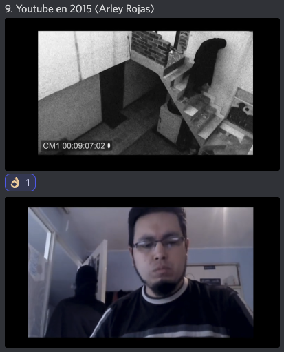

# IV Festival de Cortos de la Filmoteca Maldita 2022
SITIO FANTEAM NO OFICIAL  
[Volver al índice](../festi.md)

## Dia 11 10/07/2022 (Matias Parkman)
   

- 1.    [3] **Perro negro** - Robinson Castañeda  
- 2.    [121] **Super estallido social** – Agustín Araya  
- 3.    [86] **Sonidos y trincheras** – Jorge Ricardo  
- 4.    [149] **Herida** - Josué Sanabria  
- 5.    [51] **Pasillo**- Ángel D. Hurtado  
- 6.    [124] **El nombre viene en la descripcion** - JUAN IGNACIO Irusta  
- 7.    [53] **Oblivion** - JL Cabrera  
- 8.    [141] **B.R.E.A.K.F.A.S.T.** - Alvarutis Romero  
- 9.    [4] **YouTube en 2015** - Arley Rojas   
- 10.    [125] **Impulso** - Levi FLowers y Astru rex  

### Cortos

(Los enlaces llevan al canal de Discord "Chat sin micro")

-   
[11/01](https://discord.com/channels/739208143523020841/769436011981570068/995791971807416341)  
LeorenGamer: "*creo que ya tengo favorito en apartados tecnicos*";  
titokrause: "*Vibra a "cuentos de amor, locura y muerte" de Horacio Quiroga y a la peli "Los muertos" de Lisandro Alonso*";  
Rebel Soul Tech: "*Al ver el corto me ha recordado tanto a 'El perro de Vazquez figueroa'*";  
Feo: "*Hacer un corto de 7 minutos es difícil y este lo ha logrado.*";  
exxochiquito: "*Si parece corto profesional xd*";  
pikawaii: "*me gusta el ritmo que tiene!*";  
ElPorreteSabrosetee: "*Lo hace bastante bien el prota*"  
.  
.  
-   
[11/02](https://discord.com/channels/739208143523020841/769436011981570068/995794229693513799)  
PrivateTaylor: "*the boys en Chile.*";  
xajpot: "*The CHICAGO BOYS.*";  
marvin90kp: "*Umbrella Academy version Chilena.*";  
estebanchiri18: "*cuando la dictadura es ley?!.*";  
silverknight3: "*el concepto estaba bueno.*";  
elchicopalta: "*Me gustó la idea del detalle del rojo sobre los clips, pero tampoco me cierra como esta realizado..*"  
.  
.  
-   
[11/03](https://discord.com/channels/739208143523020841/769436011981570068/995796142560387092)  
pikawaii: "*qué buenos contrastes!!*";  
estebanchiri18: "*hoy revivio el cine*";  
rickkkk_sm: "*epa, que bueno que juegue con la relacion de aspecto, esta vez le perdono el blanco y negro*";  
el_gf: "*estan bueno los planos, pero no entiendo nada*";  
itokrause: "*momento "Pi, fe en el caos" de Aronofky*";  
Alienigena_Ancestral: "*Me recuerda a Yorgos Lanthanimos*";  
mandacarallo2: "*Los planos cenitales y primeros planos ....a mí me gustaron ! No entendí mucho la historia pero me tenía enganchada*";  
KaramazovXIX: "*Esto lo hacía Buñuel y lo aplaudíamos todos*";  
Feo: "*Postula para el casabetes, mejor sonido*";  
.  
.  
-   
[11/04](https://discord.com/channels/739208143523020841/769436011981570068/995798457329655808)  
yizuxzz: "*Ostia ballet*";  
anjasaro: "*intentando un fouette*";  
guerrerobravo777: "*Billy Elliot Latam*";  
Alienigena_Ancestral: "*Muy intimista*";  
exxochiquito: "*Hoy es noche de buena producción?*";  
titokrause: "*a mi me trasmitió la tensión*";  
xajpot: "*Corto y directo*";  
mandacarallo2: "*Yo vi documentales de Nureyev cuando ya era mayor y verle los dedos de los pies es brutal !! Increíble lo que debe sufrir la gente de la danza !!🥲*";  
cecilkutsi: "*mencanto que no lo estiro! duro lo que tuvo que durar*"  
.  
.  
-   
[11/05](https://discord.com/channels/739208143523020841/769436011981570068/995799468823814234)  
guerrerobravo777: "*Te da lo que promete...*";  
DjAiiMaR: "*luisito comunica cuando era estudiante*";  
virtuosantly: "*ILR o IRL?*";  
mandacarallo2: "*No sé qué quiere decir ...pero al final ....pues nada...camino a la facultad*"  
.  
.  
-   
[11/06](https://discord.com/channels/739208143523020841/769436011981570068/995801647190126602)  
ZoomF7: "*Flojo hasta para poner el título*";  
hariment: "*Se ha currao más el título que el corto*";  
yizuxzz: "*La verdad esto es muy raro pero se saco los huevos y dijo lo mando porque lo mando*";  
alvarutiscg: "*No, grito la verdad pam pam pampa mpa m*";  
Rebel_Soul_Tech: "*Adoro la pasion de este chaval?*";  
cecilkutsi: "*la brigada de moralidad existia!! era una division de la policia que te llevaba por cualquier gilada, x ej tener el pelo largo*"  
.  
.  
-   
  
[11/07](https://discord.com/channels/739208143523020841/769436011981570068/995802963379499099)  
Alienigena_Ancestral: "*Obivion no es un tango de Astor Piazzola?*";  
alvarutiscg: "*El libro con dientes de Harry Potter*";  
estebanchiri18: "*es alicia*";  
lukenivuak: "*visitó Oblivion*";  
stealthb4st4rd: "*la historia interminable 3*";  
tormentadelagartos: "*Folk horror*";  
alvarutiscg: "*Una visitada al Midsommar*";  
lukenivuak: "*buen diseño de sonido*";  
a_ltgr_: "*muy bien hecho, de lo mejor que hemos visto en ficcion... quizas lo unico es el cambio en el etalonaje al final, pero entiendo que es intencional*";  
elecktrip: "*Buenazo!!!!!*";  
elgatodeeris: "*brutaaaaal*";  
al_g_narvaez: "*tremendo*"  
.  
.  
-   
[11/08](https://discord.com/channels/739208143523020841/769436011981570068/995805052893659157)  
baxerri1: "*esta de huevos*";  
yizuxzz: "*Huevocartoon live action*";  
pikawaii: "*que buen voiceacting*";  
mohabdib1: "*Es la version huevuna de gritos en el pasillo xD*";  
ebel_Soul_Tech: "*por ffin la masculinidad fragil bien*";  
hariment: "*Easter Egg el huevo de las gafas de so es el mismo que hace de Gary*";  
exxochiquito: "*Jajajaj muy chulo*";  
anjasaro: "*pintar cada huevo pronunciando una vocal*";  
Feo: "*La idea es buena, la propuesta está bien. Hubiera estaddo bien añadir más huevos con distintas expresiones"*"  
.  
.  
.  
-   
[11/09](https://discord.com/channels/739208143523020841/769436011981570068/995807389427191859)  
estebanchiri18: "*dross XD*";  
Playermex: "*la morsa Pog*";  
marvin90kp: "*Drossismo*";  
paul38104: "*TOP: las siete sombras más aterradoras*";  
waltz333: "*Riders of the Storm*";  
ellystinker: "*desde avispas y abejas hasta referencias pendejas, bienvenido a doctops*";  
bakasaru_draw: "*yo creo que lo del 2015 era por el rollo videos de duendes y asi*";  
estebanchiri18: "*clik bayt!!!*";  
guerrerobravo777: "*El fantasma de los YT pasados...*";  
al_g_narvaez: "*esto le habría gustado al yoshimitsu caleon*"  
.  
.  
-   
[11/10](https://discord.com/channels/739208143523020841/769436011981570068/995809546012475594)  
MrPerezaOk: "*buenardo*";  
mandacarallo2: "*👏👏👏👏👏*";  
baxerri1: "*como mola*";  
leonactorx: "*curradisimo*";  
marvin90kp: "*Uffff que grande esta animion*";  
satiavan: "*Lindo ensamble de música y animación*";  
shadowceless: "*este si es Un viaje que yo quisiera tener*";  
Matias: "*Referencia a homestuck, el comic*";  
titokrause: "*que guapo!!!! Genial Grande Levi Flowes!*";  
a_ltgr_: "*el chico tiene mucho estilo y la musica excelente*"  
.  
.  
  
[Volver al índice](../festi.md)