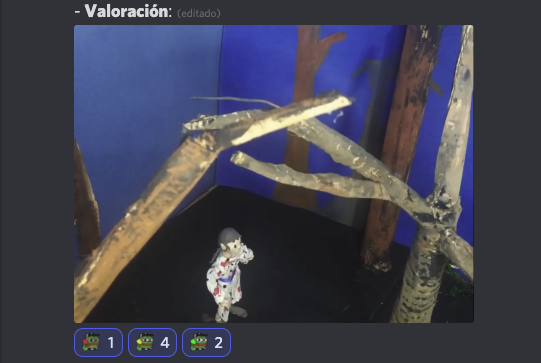

# [Inicial](./index.md)

[1](dia1.md) | [2](dia2.md) | [3](dia3.md) | [4](dia4.md) | [5](dia5.md) | [6](dia6.md) | [7](dia7.md) | [8](dia8.md) | [9](dia9.md) | [10](dia10.md) | [11](dia11.md) | [12](dia12.md) | [13](dia13.md) | [14](dia14.md)
<h2>Día 10</h2>

  

## **Día 10. Nº 1: "__Carta__"**
- **Reseña**:  
`
Una de monólogo intimista con unos sonido e imagen currados.
`

- **Opta a premios**: ¿Cassavetes? ¿Chris Marker? 
- 

## **Día 10. Nº 2: "__Muerte natural__"**
- **Reseña**: 
`
Este stopmotion de masilla moldeable es una película de cabo a rabo en dos partes. Una primera en el hilo de una caja de música; y una segunda estilo wild-west. Un posible "must see". Una sobradita de aventuras y acción.
`

- **Opta a premios**: Bill Plympton. Svankmajer.
- 

## **Día 10. Nº 3: "__Pesadilla sin fin__"**
- **Reseña**: 
`
Nuestro protagonista despierta y nos hace en el piso lo de Rec. Una de suspense cortita (pero que opta al Diaz).
`

- **Opta a premios**: a) Lav Diaz. b) Chico Ibáñez. c) Pojar.
- 

## **Día 10. Nº 4: "__La novia de Dahmer__"**
- **Pieza**: "__La novia de Dahmer__".
- **Reseña**: 
`
Lo de la vanguardia arriesgando a grabar planos de "las nuevas tecnologías", por un lado. Y, por el otro, una banda platicando de sus batallas culturales. A todo esto llega la novia de Dahmer... Una de web y phone cams con fundamento de reality y aliño de serial.
`

- **Opta a premios**: El de Chico. ¿Y un Lipsky?
- 

## **Día 10. Nº 5: "__Who?__"**
- **Reseña**: 
`
Mi amigo debe ser un pájaro, porque vuela; mortal debe ser mi amigo, ¡porque muere! Pica ahí, ¡como una abeja! Oh, qué curioso amigo, ¡que me desconcierta!
`

- **Opta a premios**: ¿Un Dupieux? ¿Pojar?
- 

## **Día 10. Nº 6: "__Reportaje ciudadano__"**
- **Reseña**: 
`
Un "Obra 67" (guiño a David Sainz) ahora sí ¡bien resuelta! Municiones para disidentes de la caja tonta. Buena puesta en escena, buena actuación. Una de suspense chachi.
`

- **Opta a premios**: ¿Chicho? ¿Un Gavras? ¿Un Marker?
- 

## **Día 10. Nº 7: "__Aires Acondicionados__"**
- **Reseña**: 
`
Por el color, reminiscencias en esta pieza de la uva que encontramos por ejemplo, en Faemino y Cansado; pero no mancha la copa así que lleva esa uva, sí, pero la de cuando dichos humoristas andaban ensayando antes de lograr la fórmula magistral para trillar chascarrillo; es vino joven. Un plano secuencia sorprende en el aroma. Una de stand up encubierto.
`

- **Opta a premios**: ¿Lav Diaz? ¿Python? ¿Tarr? ¿Dupieux? ¿Lleva un Gavras?
- 

## **Día 10. Nº 8: "__Dopamina Zero__"**
- **Reseña**: 
`
Las piezas que alumbran los autores van cayendo al acerbo colectivo siendo atraídas a otras similares por magnetismos de género. Cuando esta pieza llegue allí donde pertenece se hará notar y recibirá honores. Un cómic de acción con todas las letras.
`

- **Opta a premios**: Plympton. Chicho Ibáñez. Anger/Moctezuma. Ennio Morricone. Sion Sono. Dupieux. Gavras.
- 

## **Día 10. Nº 9: "__El león de Berbería__"**
- **Reseña**: 
`
A la memoria de uno de esos animales de los que los antiguos egipcios aseguraban que la Naturaleza había creado para que los humanos pudiéramos acariciar a los tigres. Una poesía de requiem para Cassavetes.
`

- **Opta a premios**: Cassavetes. Moctezuma, Chicho, Sion Sono, Dupieux. Morricone.
- 

## **Día 10. Nº 10: "__No Actor__"**
- **Reseña**: 
`
¡Rara pero atrayente! ¡Oscura pero deslumbrante! Una experimental de malabares cartesianos.
`

- **Opta a premios**: Dupieux, Tarr, Marker, Chico, Moctezuma, Morricone.
- 

## **Día 10. Nº 11: "__Sanguinem__"**
- **Reseña**: 
`
Un grupo de amigos inmersos en turbia situación. La pieza acoge al espectador ubicándolo uno más del grupo. Así, en nada, la escena esta lista para sangrar. Esta piecita está rodada, pulcramente, a patrón. Un slasher pringoso (comenta el FeO que Jason Pérez mejor que ningún nombre).
`

- **Opta a premios**: Sono, Chicho. Morricone.
- 

# [Inicial](./index.md)

[1](dia1.md) | [2](dia2.md) | [3](dia3.md) | [4](dia4.md) | [5](dia5.md) | [6](dia6.md) | [7](dia7.md) | [8](dia8.md) | [9](dia9.md) | [10](dia10.md) | [11](dia11.md) | [12](dia12.md) | [13](dia13.md) | [14](dia14.md)

