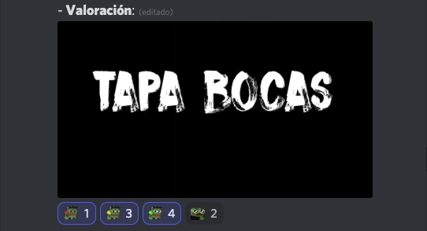
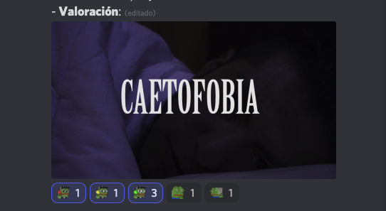

# [Inicial](./index.md)
<h2>Día 11</h2>

  


## **Día 11. Nº 1: "__El sonido del trueno__"**
- **Reseña**: ```Sin palabras, sorry.```
- **Opta a premios**: Una para el Costa Gravas. O Cassavetes,
- 


## **Día 11. Nº 2: "__Vida Extra__"**
- **Reseña**: ```Siete minutos que pasan en un suspiro, pulsión de vida en una melodía que te suspende el juicio; justo antes de convocarte al dilema. Una de supervivencia cruda y exquisita.```
- **Opta a premios**: Un Gavras. (¿Carpenter? ¿Morricone?)
- 


## **Día 11. Nº 3: "__Contrataque a los titanes.__"**

- **Reseña**: ```Fue Prometeo, en un cierto contexto, el primero en robarle el fuego a los Dioses? Este retake sobre el Héroe de las Mil Caras divierte y es conciso. Juega muy bien con cuatro recursos y, más, los saca del cine mudo. Una de acción bien tirada.```
- **Opta a premios**: Chris Marker. ¿Chicho? Con toques de Svankmajer.
- 


## **Día 11. Nº 4: "__Una sinfonía por la noche__"**
- **Reseña**: ```De alteridades. De polaridad onírica. De inconsciente, subconsciente y consciente. Recuerdos, sueños y pensamientos. Una de terror concreto.```
- **Opta a premios**: ¿Chicho? Gavras... Moctezuma...
- 


## **Día 11. Nº 5: "__Escarnio.__"**
- **Reseña**: ```¿Lo del Becerro de Oro? ¿Una tiradera a las cárnicas? Los creadores de esta pieza tienen veda libre para desarrollar el boceto. Una animación fluida.```
- **Opta a premios**: Un Plympton. O Anger. O Dupieux. O Morricone.
- 


## **Día 11. Nº 6: "__El extraño caso de Bruno Bellos y su inesperado giro argumental__"**
- **Reseña**: 
```
En el chat:
- El Nattram argentino, bro.
- Hagan sección premio smosh.
- Jean-Luc Godard ¿eres túuu?
- Bruno vs Pedro Pólvora. 
Una caricatura que es toda una golosina.
```
- **Opta a premios**: Gavras, Lipsky, Python.
- 


## **Día 11. Nº 7: "__Tapa bocas__"**
- **Reseña**: ```Una idea sencilla con ritmo y bien ejecutada. Aprovecho esta reseña (a día 8 de Julio de 2021) para mentar a Samuel, DEP. ¿Es este corto un sordomudo de Miguel Noguera? Una de hardcore funk.```
- **Opta a premios**: Chicho. Sono. Gavras. Marker. Lipsky. Python.
- 


## **Día 11. Nº 8: "__El úndecimo año después__"**
- **Reseña**: ```Un cóctel molotov certero y quirúrgicamente efectivo. Cuando la reivindicación es útil e imprescindible. Un spot de denuncia, mordaz e incisivo.```
- **Opta a premios**: Gavras. Pojar.
- 


## **Día 11. Nº 9: "__Lo siento.__"**
- **Reseña**: ```Allí donde el esfuerzo amateur apunta maneras y visos de futuro esta pieza enamora en tanto que intención. Un thriller conmovedor.```
- **Opta a premios**: Tarr... Lav Diaz... Chicho...
- 

## **Día 11. Nº 10: "__Caetofobia__"**
- **Reseña**: ```La caetofobia también llamada tricofobia, hipertricofobia, tricopatofobia o quetofobia es el miedo o temor irracional al cabello o pelo, el tenerlo, no tenerlo, verlo, sentirlo y hasta olerlo. En este corto encontramos una fotografía al punto; tremendos destellos de efectos especiales; y una banda sonora soberbia. Agárrate a la silla cuando te pongas esta pieza; te despertará las fobias. Una de terror psicológico, magistral.```
- **Opta a premios**: Lipsky. Sono. Bava.
- 


