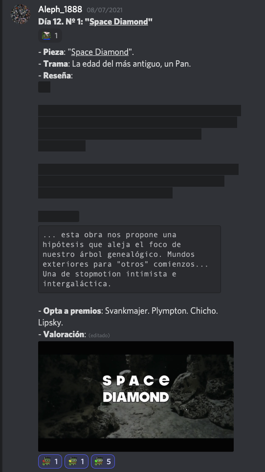
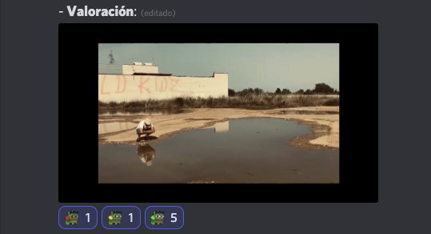
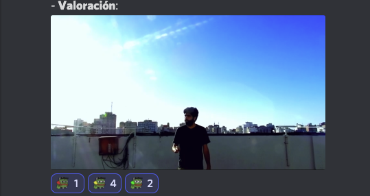

# [Inicial](./index.md)

[1](dia1.md) | [2](dia2.md) | [3](dia3.md) | [4](dia4.md) | [5](dia5.md) | [6](dia6.md) | [7](dia7.md) | [8](dia8.md) | [9](dia9.md) | [10](dia10.md) | [11](dia11.md) | [12](dia12.md) | [13](dia13.md) | [14](dia14.md)
<h2>Día 12</h2>

  

*Reseñas y comentarios, Los Alephes & Cía.* (tu agencia de confianza para *presencia en redes sociales* y para *gestión de la imagología*; contacta al 555-25-35-02) **informa**:

La decena de cortos que a continuación se reseñarán vendrán cosidos en un **centro de interés**. ||Este "tema" o "nexo" será relativo a la **cronología de la evolución humana** que, según la wiki, vendría en la Tierra tras un período de más o menos **siete millones de años, desde la separación del género Pan** hasta la aparición del **comportamiento moderno hace 50.000 años**. Las reseñas de estos cortos girarán todas en torno a eso que sucedió, sucede y, sucederá, tras la aparición de El Homo Sapiens...||

Nota: Las dos barras verticales indican bloque "oculto", como en la imagen:

- 

## **Día 12. Nº 1: "__Space Diamond__"**
- **Trama**: La edad del más antiguo, un Pan.
- **Reseña**: 
||Si...

... buscamos la rama exacta del árbol genealógico en su orden "primate" para identificar el punto de partida de la especie sapiens dentro de la familia de los Homínidos;...

... y si encontramos dos de estas ramas: una a 315.000 años en lo que hoy es Marruecos; y otra a 165.000 años en Pinnacle Point (Sudáfrica);... 

...entonces:||

`

... esta obra nos propone una hipótesis que aleja el foco de nuestro árbol genealógico. Mundos exteriores para "otros" comienzos... Una de stopmotion intimista e intergaláctica.

`

- **Opta a premios**: Svankmajer. Plympton. Chicho. Lipsky.
-   

## **Día 12. Nº 2: "__Fondo__"**
- **Trama**: La madre Pan, la mitocrondrial.
- **Reseña**: 
||Si...

... al seguir la línea genealógica por vía materna de cada persona en el árbol genealógico de toda la humanidad, la Eva mitocondrial correspondería a un antepasado femenino común que comparte toda la población actual de seres humanos (Homo sapiens); y si basándose en la técnica de reloj molecular su encarnación se estima en 200.000 años atrás en el África Oriental;...

...entonces:||

`

Si la madre (Eva) acompañara a la narradora de este corto seguro que no se escandalizaría hasta el pánico, como lo hace el espectador. Ella  nos dio en herencia una forma de fuerza, liberable (o no) en forma de violencia. Un thriller durete.

`

- **Opta a premios**: Tarr, Chicho, Gavras, Morricone.
-   

## **Día 12. Nº 3: "__Hoy fue un día soleado__"**
- **Trama**: La madre Pan, la mitocrondrial.
- **Reseña**: 
||Si...

... al seguir la línea genealógica por vía materna de cada persona en el árbol genealógico de toda la humanidad, la Eva mitocondrial correspondería a un antepasado femenino común que comparte toda la población actual de seres humanos (Homo sapiens); y si basándose en la técnica de reloj molecular su encarnación se estima en 200.000 años atrás en el África Oriental;...

...entonces:||

`

Si la madre (Eva) acompañara a la narradora de este corto seguro que no se escandalizaría hasta el pánico, como lo hace el espectador. Ella  nos dio en herencia una forma de fuerza, liberable (o no) en forma de violencia. Un thriller durete.

`

- **Opta a premios**: Tarr, Chicho, Gavras, Morricone.
-   

## **Día 12. Nº 4: "__Florencia__"**
- **Trama**: La época sapiens.
- **Reseña**: 
||
Si...

... cualquier historia es una subhistoria de la historia que se cuenta desde finales del Pleistoceno en adelante, desde hace unos doce mil años;...

... y si...

... dentro de una división de la escala temporal geológica, la última y actual época del período Cuaternario que comenzó hace 11.700 años correspondería al Holoceno (del griego "holos", todo, y "kainos", reciente);...

... entonces:||

`

¿dejará, en lo reciente, huella o peso este corto como una de esas subhistorias de la Gran Historia? Apuesto a que este poema, monólogo interpretado, sí, lo dejará, aunque no será denso, como el plomo, sino gentil, delicado y grácil como una pluma... Una historia bien transmitida ideal para contar en corro.

`

- **Opta a premios**: Marker, Tarr, Chico.
-   

## **Día 12. Nº 5: "__La cosa nuestra__"**
- **Trama**: Lo nuestro sapiens.
- **Reseña**: 
||Dado:

... el sapiens como un animal "simbólico". Y, particularmente, de los símbolos tipo "significantes" que subyacen como fundamentos elementales para todo pensar complejo y que transcienda a lo instintivo;

... y dada:

... la tesis de Heidegger según la cual el lenguaje es la casa del ser (Haus des Seins) y la morada de la esencia humana:
||

`

¿está este corto "In da House"? O sea, ¿esta pieza, revive o forjará símbolo? Apuesto a que sí. ¡La cosa es el cine, y es nuestro! Una tragicomedia resultona.

`

- **Opta a premios**: Marker, Gavras, Cassavetes.
-   

## **Día 12. Nº 6: "__Entrar y salir__"**
- **Trama**: Aventuras humanas.
- **Reseña**: 
||Se define que...

... los seres humanos posean capacidades mentales que les permitan inventar, aprender y utilizar estructuras lingüísticas complejas, lógicas, matemáticas, escritura, música, ciencia y tecnología;...

... y, por enunciado:...

... los seres humanos son animales sociales, capaces de concebir, transmitir y aprender conceptos totalmente abstractos:||

`

escribir, interpretar y filmar una pieza como "Entrar y salir" es una de esas peripecias al alcance de pocos animales, diría que exclusivamente de los humanos. Una de acción ingeniosa y caótica.

`

- **Opta a premios**: Gavras... Lipsky. Python. Chicho.
-   

## **Día 12. Nº 7: "__Este no es mi hogar__"**
- **Trama**: El Espíritu.
- **Reseña**: 
||Dado...

... que en muchas civilizaciones los seres humanos se ven a sí mismos como diferentes de los demás animales, y en ciertos ámbitos culturales (como las religiones del Libro o buena parte de la metafísica del Occidente) la diferencia se asigna a una entidad inmaterial llamada alma, en la que residirían la mente y la personalidad, y que algunos creen que puede existir con independencia del cuerpo:
||

`

¿el espectador resonará a través su alma con este corto? ¿vibrará la obra tales fibras espirituales que incidan y remuevan al espectador como estas modernas butacas de cine 9D? ¡Apuesto a que, un poco sí! Esta pieza tiene alma. Y, quizás, por ello, como al hablar del espíritu, cueste de explicarla. Una de fotografía introspectiva que ha quedado como Powerpoint en tonos verdes.

`

- **Opta a premios**: Marker. Moctezuma, Cassavetes. Tarr. Diaz.
-   

## **Día 12. Nº 8: "__Miedos exteriores__"**
- **Trama**: Las civilizaciones.
- **Reseña**: 
||Considérese una primera variable (x) cargada con...

... etnocentrismo, considerado como un estimativo ideológico a través del cual el individuo analiza el mundo de acuerdo con los parámetros de su propia realidad;...

... y una segunda cargada con...

... un relativismo cultural (y) donde cada cultura deba ser estudiada o interpretada desde sus propias creencias, valores, prácticas, hábitos, etcétera: 

Si este corto (C) se opera del modo Cx/Cy para calcular su media de veracidad, ¿qué deriva?||

`

Apuesto a que el protagonista de este corto usufructúa un estimativo ideológico; y, también, del mismo tamaño, una interpretación propia muy tocha; Cx/Cy en esta pieza, calculo, tiende a infinito... Una de egografía trepidante y veraz.

`

- **Opta a premios**: Dupieux. Marker, Gavras, Lipsky. Moctezuma, Morricone.
-   

## **Día 12. Nº 9: "__Estática__"**
- **Trama**: El método sapiens.
- **Reseña**: 
||Dado un conjunto que cierre la clase...

... "ciencia" (del latín scientĭa, ‘conocimiento’) como un sistema que organiza y ordena el conocimiento a través de preguntas comprobables y un método estructurado que estudia e interpreta los fenómenos naturales, sociales y artificiales;...

... y, dado un límite asintótico de este conjunto, que sea...

... el criterio de demarcación, donde se delimita si una teoría es científica siéndolo si y solo si esta es progresiva empíricamente, es decir, si predice hechos nuevos y explica parte de estos además de los ya conocidos:||

`

¿esta obra, abunda en ciencia? Apuesto a que el espectador responderá con anuencia señalando un trabajo de edición correcto y una actuación correcta; y si ahora cuestionamos ¿y se excede de ciertos límites? Apostaría a que de nuevo el espectador aquiescente, un tanto boquiabierto. Una de pseudo-ciencia-ficción que sugiere más que desvela.

`

- **Opta a premios**: Chicho, Morricone, Moctezuma, Sono.
-   

## **Día 12. Nº 10: "__La fábrica de deshauciados__"**
- **Trama**: La cadena trófica.
- **Reseña**: 

||¿Se considera a los humanos como superdepredadores; esto es: depredadores que no tienen depredadores naturales, situándose en lo alto de su cadena alimentaria? 

¿Cuánto de habitual hay en la condición de Homo homini lupu, que significa ‘el humano es un lobo para el humano' y se cita con frecuencia cuando se hace referencia a los horrores de lo que es capaz la humanidad para conseguir lo que quiere?||

`

Supóngase al espectador como un depredador-cultural. Este corto, ¿qué le supone? ¿alimento o encierra una amenaza depredadora? ¿Quién se come a quién? Apuesto a que esta sublime obra nutre como la miel o la jalea real... Una de animación que el Jerry le pedirá al FeO para revenderla en Netflix.

`

- **Opta a premios**: Plympton, Gavras, Marker, Chicho,  Morricone. Cassavetes.
-   

# [Inicial](./index.md)

[1](dia1.md) | [2](dia2.md) | [3](dia3.md) | [4](dia4.md) | [5](dia5.md) | [6](dia6.md) | [7](dia7.md) | [8](dia8.md) | [9](dia9.md) | [10](dia10.md) | [11](dia11.md) | [12](dia12.md) | [13](dia13.md) | [14](dia14.md)

