# [Inicial](./index.md)

[1](dia1.md) | [2](dia2.md) | [3](dia3.md) | [4](dia4.md) | [5](dia5.md) | [6](dia6.md) | [7](dia7.md) | [8](dia8.md) | [9](dia9.md) | [10](dia10.md) | [11](dia11.md) | [12](dia12.md) | [13](dia13.md) | [14](dia14.md)
<h2>Día 13</h2>

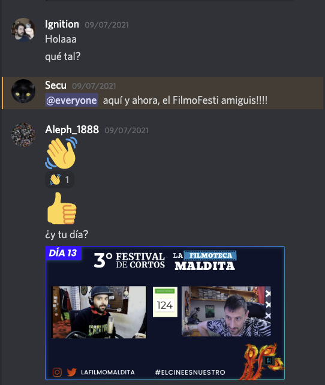  

La sección sindical de *Reseñas y comentarios, Los Alephes & Cía.* (tu agencia de confianza para *presencia en redes sociales* y para *gestión de la imagología*; contacta al 555-25-35-02), al unísono, **informa**:

La decena de cortos que a continuación se reseñarán formarán parte de los **servicios mínimos** establecidos en el pacto entre parte patronal y parte sindical ante la "I Huelga colectiva de reseñadores y comentadores". 

Perdonen las molestias, estamos luchando por ofrecer un mejor servicio en unas mejores condiciones. 

||Efectivamente, dados los acontecimientos sucedidos en la primavera 2021 mediante los cuales el sindicato mayoritario informó a la patronal de reseñadores y comentadores, la PRC, de la lista pormenorizada de puntos de conflictos así como de la lista pormenorizada solucionario de los mismos; y, agotado el tiempo, totalmente desoídas por la PRC, se resuelve que:

**La unión de sindicatos ha convocado una huelga para el día 9 de julio 2021 que revierta el paro de las actividades de reseña y comentario**. Eso sí, parón dentro de un marco de "servicios mínimos" que en todo caso habrán de ser escuetos, nimios, meramente a título y efecto de presencia; nota: habrán piquetes y se vandalizará toda reseña o comentario con más extensión de lo debido...||

## **Día 13. Nº 1: "__¡Huas, Huas!__"**

- **Reseña**: 

||
**jimerito**

- 1. m. Hond. Abeja pequeña de color amarillo, sin aguijón, que vive en los agujeros de las paredes y cuya miel es medicinal.
||
`
Esta obra es pura miel de jimerito. 
`
- **Opta a premios**: Plympton, Dupieux, Gavras. ¿Marker?
- 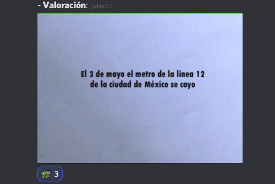  

## **Día 13. Nº 2: "__Crisis de la Taxonomía__"**
- **Reseña**:  

||
**requebrar**

(**Conjug. c. acertar.**)

- 1. tr. Volver a quebrar en piezas más menudas lo que estaba ya quebrado.

- 2. tr. Halagar a alguien, especialmente a una mujer, con piropos o palabras que destaquen sus atractivos. 
||
`
Esta pieza requiebra la teoría taxonómica a modo de magistral; así expuesto, este corto es un requiebro para la taxonomía.
`
- **Opta a premios**: Plympton. Svankmajer.
- 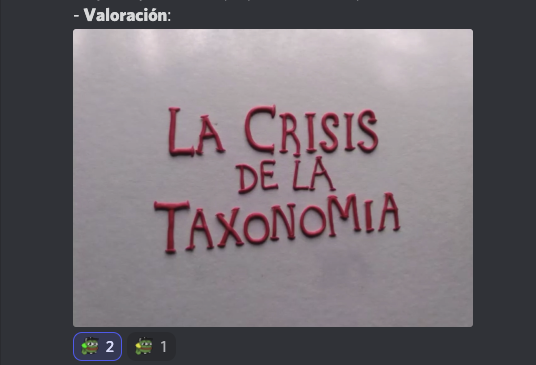  

## **Día 13. Nº 3: "__Memoria persistente__"**

- **Reseña**:  

||
**ormesí**
- 1. m. Tela fuerte de seda, muy tupida y prensada, que hace visos y aguas.
||

`
Un ormesí de memoria persistente, visos de conciencia y aguas de corazón.
`
- **Opta a premios**: Gavras. Cassavetes. Marker. ¿Morricone?
- 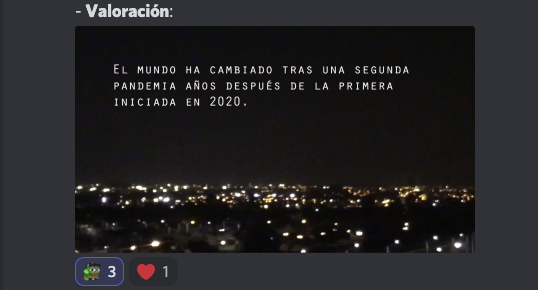  

## **Día 13. Nº 4: "__Control mental__"**
- **Reseña**:  

||
**bragadura**

(**De braga1 y -dura.**)

- 1. f. Entrepierna del humano o del animal.

- 2. f. Parte de las bragas, calzones o pantalones, que da ensanche al juego de los muslos.

**crica**

(**Cf. clica.**)

- 1. f. Partes pudendas de la mujer.
||
`
Esta pieza de animación es una caricia en la bragadura y un lametón en la crica.
`
- **Opta a premios**: Plympton. Gavras.
- 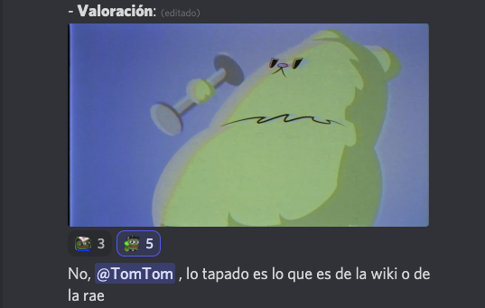   

## **Día 13. Nº 5: "__Sin lugares para el rosa__"**

- **Pieza**: "__Sin lugares para el rosa__".
- **Reseña**:  

||
**zoantropía**

(**De zoo- y el gr. ἄνθρωπος ánthrōpos 'hombre'.**)

- 1. f. Med. Especie de monomanía en la cual el enfermo se cree convertido en un animal.

**desenalbardar **

- 1. tr. Quitar la albarda, desaparejar las bestias.
||
`
El estigma zoantrópico de un machismo a desenalbardar, en clave rosa.
`
- **Opta a premios**: Gavras, Marker, Cassavetes.
- 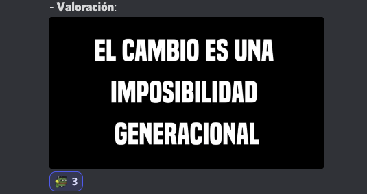  

## **Día 13. Nº 6: "__Solo diviertiéndose en un agotador trabajo.__"**
- **Reseña**:  

||
**hipocrénides**

(**Del lat. Hippocrenĭdes, de Hipocrene, fuente consagrada a las musas.**)

- 1. f. pl. cult. musas (‖ deidades).

**ostial**

(**Del lat. ostium 'puerta'.**)

- 1. m. Entrada de un puerto o canal.
||
`
Neonata, cuando baje de dónde las hipocrénides, y arribe al ostial de la animación, esta obra será acogida con vítores.
`
- **Opta a premios**: Plympton, Pojar, Python.
- 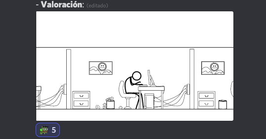  

## **Día 13. Nº 7: "__Ni una lucha aislada__"**
- **Reseña**:  

||
**períptero, ra**

(**Del lat. periptĕros, y este del gr. περίπτερος perípteros.**)

- 1. adj. Arq. Dicho de un edificio, especialmente de un templo clásico: Rodeado por columnas. U. t. c. s. m.

**acanaladura**

(**De acanalar.**)

- 1. f. Canal o estría.

- 2. f. Arq. Estría que se talla verticalmente o en hélice en columnas, pilastras u otros objetos decorativos.
||
`
Un períptero sindical y sindicalista. Columnas de lucha cuyas acanaladuras llevan tallado nombre y apellidos. ¡Ni una lucha aislada!
`
- **Opta a premios**: Gavras. Marker. Cassavetes.
- 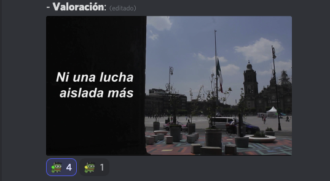  

## **Día 13. Nº 8: "__Neza que mas aplauda/ No acabarán mis flores...__"**
- **Reseña**:  

||
**brocadillo**

(**Del dim. de brocado.**)

- 1. m. Tela de seda y oro, de inferior calidad y más ligera que el brocado.

Nezahualcóyotl, poema "**No acabarán mis flores**":

- *No acabarán mis flores*,  
    *no cesarán mis cantos*.  

    *Yo cantor los elevo,*  
    *se reparten, se esparcen.*  

    *Aun cuando las flores*  
    *se marchitan y amarillecen,*  
    *serán llevadas allá,*  
    *al interior de la casa*  
    *del ave de plumas de oro.*
||
`
Esta pieza es un brocadillo cuya seda es de redoble de tambores; y su oro de ancestral ave.
`
- **Opta a premios**: Pojar, Gavras.
- 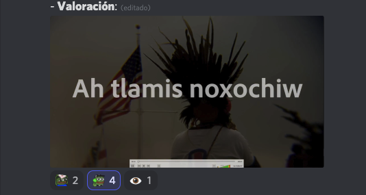  

## **Día 13. Nº 9: "__Examen de matemáticas__"**
- **Reseña**: 
`
(Mensaje del piquete que está vigilando esta columna de reseñas. La novena no se publica por servicios mínimos debido a la I Huelga colectiva contra la negativa del PRC a satisfacer las demandas sindicales.)
`
- **Opta a premios**: Pojar, Marker, Svankmajer.
- 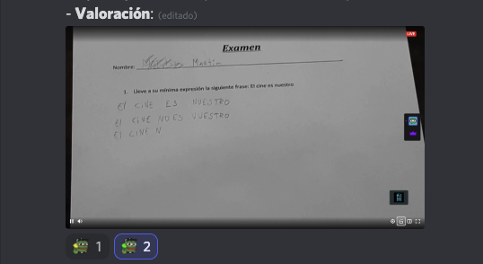  

## **Día 13. Nº 10: "__Rojo__"**
- **Reseña**: 

||
**afacimiento**

- 1. m. desus. Acción y efecto de afacer.

**afacer**

(**Del lat. *affacĕre, por afficĕre 'hacer'.**)

- 1. intr. desus. Acostumbrarse, hacerse a algo. Era u. m. c. prnl. U. en Ast.

- 2. intr. desus. Tener comunicación o trato. Era u. t. c. prnl.

**rojo, ja**

(**Del lat. russus.**)

- 1. adj. Dicho de un color: Semejante al de la sangre o al del tomate maduro, y que ocupa el primer lugar en el espectro luminoso. U. t. c. s. m.
||
`
¿Un afacimiento en Bellas Artes sobre el rojo sensorial?
`
- **Opta a premios**: Dupieux, Sono, Marker, Bava, Chico, ¿Tarr, Diaz?
- 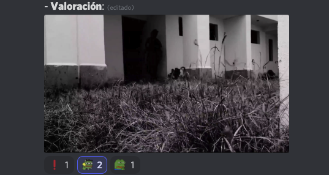  

## **Día 13. Nº 11: "__Nostalgia__"**
- **Reseña**:  

||
**carrendera**

- 1. f. Sal. Camino real o carretera.

**cupido**

(**De Cupido, hijo de Venus, dios del amor en la mitología romana.**)

- 1. m. Representación pictórica o escultórica del amor, en la forma de un niño desnudo y alado que suele llevar los ojos vendados y porta flechas, arco y carcaj.
||
`
Por una carrendera audiovisual Cupido otea para nosotros la piel de la Madre Tierra. 
`
- **Opta a premios**: Pojar, Lipsky, Bava, Morricone.
- 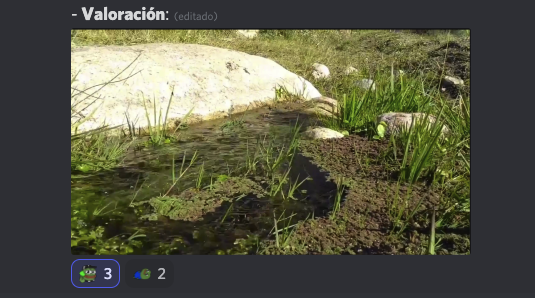  

# [Inicial](./index.md)

[1](dia1.md) | [2](dia2.md) | [3](dia3.md) | [4](dia4.md) | [5](dia5.md) | [6](dia6.md) | [7](dia7.md) | [8](dia8.md) | [9](dia9.md) | [10](dia10.md) | [11](dia11.md) | [12](dia12.md) | [13](dia13.md) | [14](dia14.md)
