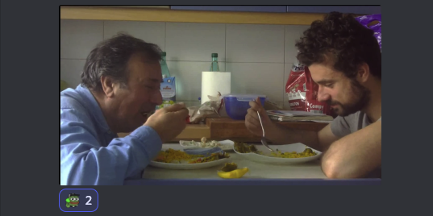

# [Inicial](./index.md)

[1](dia1.md) | [2](dia2.md) | [3](dia3.md) | [4](dia4.md) | [5](dia5.md) | [6](dia6.md) | [7](dia7.md) | [8](dia8.md) | [9](dia9.md) | [10](dia10.md) | [11](dia11.md) | [12](dia12.md) | [13](dia13.md) | [14](dia14.md)
<h2>Día 14</h2>

  

**La Patronal de Reseñadores y Comentadores (P.R.C.)** de la empresa *Reseñas y comentarios, Los Alephes & Cía.* (R.C.L.C. & Cía) (tu agencia de confianza para *presencia en redes sociales* y para *gestión de la imagología*), en respuesta a los hechos sucedidos el día 9 de julio de 2021, y derivadas unas tamañas y cuantiosas pérdidas debido al parón de la I Huelga sindical, contra el gobierno y contra nosotros mismos, **informa**:

La decena de cortos que a continuación se reseñarán provienen, ya no de R.C.L.C. & Cía, como agencia, sino de un lugar lejano allende los mares tras la venta de la empresa y todos sus activos a un fondo de capital riesgo internacional llamado Global Risking Sharks (G.R.S.); **puede que los habituales a esta columna de reseñas y comentarios noten algo "raro" debido al cambio de dueño**. 

__Advertencia__: todo el contenido de la columna es ficción y ningún nombre o enlace tienen correspondencia con la realidad.

||Dear spectator,

I'm talking **on behalf of the new owner** of *Reviews & commentaries, Los Alephes & Cía.* for now on: **The Alephs & Co.**

First, would like to salute you as I know you've been following for 14 days now, reviewing & commenting, this place. Secondly, as you will discover, since the P.R.C. sold the company there, next, there will be some little bit of changing things.

**We strongly believe that the greatest "corto" festival on "lengua hispana", the "malditas filmoteque" big event, must be exported over the world.**

That's why we introduce a change on the following reviews & commentaries. So, the show will keep on, but **targeting anglo-saxon** and, of course, with **some ads**.

Thanks for reading!

Yours...
... **Global Risking Sharks**, "*G.R.S, your financial partner*". 

From Gamonal to the sky, 10th july, 2021.
||

## **Day 14. Nº 1: "__El monarca__"**
- **Review**: 

||
Roses are red.
Violets are blue.
Onions stink.
And so do you...

... an so does this "cortoú" about the advocacy of women's rights on the ground of the equality of the sexes.
||
- **Sponsored by / Publicidad**: 
> **Click on spoiler area** *to uncover the review of this "corto". Subscribe **Shark Premium** to automatically dismiss this message. More info at http://sharks-community.grs*

> *Reformas, El Tío Sam.*, ¡indícanos unas coordenadas: te desbrozamos y montamos una *democracia desarrollada* en un periquete! ¡Llama ya; pide presupuesto!

- **Award categories**: Gavras. Marker. Lipsky. Cassavetes.
  

## **Day 14. Nº 2: "__Inspiración__"**
- **Review**:

||
Popular refranerou quote: "How nice it is to see the rain and not get wet."

... for sure this cortoú is wet, wet, wet. A nice joke about inspiration!
||
- **Sponsored by / Publicidad**: 
> **Click on spoiler area** *to uncover the review of this "corto". Subscribe **Shark Premium** to automatically dismiss this message. More info at sharks-community dot grs.*

> **http://pcc.coop.com** *(partido-comunista-chino-cooperativa-compañía)*: "expertos en experimentos capitalistas y milagros económicos al por mayor". Ya operamos en todo el planeta.

- **Award categories**: Marker. Morricone. Lipsky, Tarr,...
  

## **Day 14. Nº 3: "__Tierra baldía__"**
- **Review**:

||
From Luther King's quote: "The ultimate measure of a person is not where he/she stands in moments of comfort and convenience but where he/she stands in times of challenge and controversy."

... well, this piece is pure controversy. So keep calm & be ready! A cool cortou about the examination or observation of one's own mental and emotional processes.
||
- **Sponsored by / Publicidad**: 

> **La Casa-Concilio de Jerusalem**, *un centro terapéutico y ecuménico de reintegración fundamentalista*. Gran tasa de éxito en reintegrar fundamentalistas y recuperarlos para la normalidad gracias a tecnologías ecuménicas. Consulta tu caso sin compromiso. Disponemos de test de autoevaluación fundamentalista totalmente gratuito.

- **Award categories**: Marker. Cassavetes. Tarr. Carpenter. Lipsky. Lav Diaz.

  

## **Day 14. Nº 4: "__Vida cotidiana y pandemia__"**- **Title**: "__Vida cotidiana y pandemia__".
- **Review**:

||
Confucius' quote: “We all have two lives, the second begins when we realize we only have one.”

... I would say that people who made this "corto" already knew it. Even also, they know about more lives. Superb cortou about the capacity to recover quickly from difficulties.

Nota: 

**Antiguos reseñadores y comentaristas** previos a la renovación de plantilla ocurrida el día 10 de julio a tenor, por mor y so capa de la adquisición de la empresa por parte del fondo Global Risking Sharks (G.R.S.), agregamos esta nota para **informar de que no estamos de acuerdo con que se sponsorice esta columna de reseñas** y expresamos así nuestro desacuerdo. ¡Los sponsors vienen con breviario para el guión y nos condicionan las reseñas! ¡Exigimos libertad de opinión! ¡Que no aten nuestras plumas! 
||
- **Sponsored by / Publicidad**: 

> **Reliquias Romanov, S.L.**, *decora tu habitación con stock imperial*. Todo tipo y caso de objetos de palacio o corte. ¡¡Desde 1917 liquidando por cierre!! ¡¡Últimas existencias!!

- **Award categories**: Cassavetes. Tarr. Gavras. Marker. Diaz. ¿Moctezuma, Morricone?

  

## **Day 14. Nº 5: "__Regresión__"**
- **Review**:

||
Sponsored by "Patronato of Turismo de Londres" [click to visit], from Johnson's quote: "When a man is tired of London, he is tired of life; for there is in London all that life can afford".

... for sure this cortou is one of these things you may find in London. Huge distopian about prevalent disease over a whole country or the world, includes plot twist.

Nota: 

— ¡¿Londres, Pardiez?! —en la cabina de redacción, uno de los antiguos reseñadores, oprimido por los cambios del opresor fondo Global Risking Sharks, haciendo grandes aspavientos, inquiriéndole a otro de la resistencia— ¡Ya han empezado a sponsorizar!
||
- **Sponsored by / Publicidad**: 

> **Derribos Hijos e hijas de Mandela, S.A.**, *el desapartheidador más eficaz del mercado*. 9 de cada 10 politólogos lo recomiendan. Analizamos el rigor de tu apartheid en 48 horas remitiendo análisis y presupuesto en 72 horas. 

> ¿Imaginas vivir en un mundo sin segregación racial? ¿Estás enamorado de alguien pero el apartheid te impide citarte con esa persona? No lo pienses más, ¡¡pide análisis y presupuesto sin compromiso!!

- **Award categories**: Mario Bava/Nicolas Winding Refn. Gavras. Marker.
  

## **Day 14. Nº 6: "__El patio__"**
- **Review**:

||
Sponsored by "Agencia de Viajes Las Palomas" [click to visit], from Lao Tzu's quote: "The journey of a thousand miles begins with one step."

... this "corto" has already walked thousand miles! A long speech by one actor in a theatrical story about the state or situation of being alone.

Nota: 

—¡Ale! —en la cabina de redacción, los dos resistentes; el que no habló antes. Rictus de resignación— ¡Esta va de viajes!
||
- **Sponsored by / Publicidad**: 

> **Delegado Zero, Corp.**, *tu agencia de training-coaching revolucionario*. 

> ¿Sientes que tu movimiento se desinfla? ¿Se ha cortado la coleta el último amado lider, apeándose de la maquinaria? ¿Cuando comentáis el panorama de la comunidad con tus compañeros de lucha acabáis con frecuencia hablando de gallinas sin cabeza giranduleando sangre en un pandemonio de confusión? 

> ¡¡No dudes un segundo más!! ¡¡Contacta con Delegado Zero y requiere los servicios de un trainer-coach especializado en levantar la moral, fortalecer los nexos comunitarios, despejar y acrisolar los objetivos comunes, resaltar y mantener los trazos de identidad grupal y no solo eso, mucho más!! 

> Nota: Se recomienda un delegado-trainer-coach por cada 50 revolucionarios. Se hacen packs de descuento por cantidades grandes. Consultar condiciones en http://zero-delegado.ezln.red/delegados-school; o enviar mensaje preguntando por "Don Marcos" o por "Don Durito" al 555-55-55-55.  

- **Award categories**: Una Marker. Diaz, Tarr.

  

## **Day 14. Nº 7: "__Caso: 13HE__"**
- **Review**:

||
Sponsored by "Gestoría La Palmera (que se dobla y resiste al huracán); seguros buenos, bonitos y baratos." [click to visit], from Lenon's quote: "Life is what happens when you’re busy making other plans."

... this "cortou" is, no doubt, pure life, no plan! An apocalyptic social fighting bullet loaded of future!

Nota: 

— ¡Cáspita! ¡Ahora vendiendo seguros! —gesticula impotente dando claras muestras de rendirse— ¡En fin!
||
- **Sponsored by / Publicidad**: 

> **Perceptrones Minsky & sons**, *tu dealer the redes neuronales*. No importa si tienes Big Data o no. No importa si tienes maquinaria para correr entrenamiento. No importa si tienes modeladores. No importa si tienes plataformas de servicio. Te lo servimos como quieras, en pack montado o por piezas. *PM & sons*, todo lo que necesitas en inteligencia artificial.

- **Award categories**: Lipsky, Bava, Plympton. Chicho. Gavras. Cassavetes. Carpenter.

  

## **Day 14. Nº 8: "__Instancia/Caminante__"**
- **Review**:

||
Sponsored by "Gremio Socorristas para piscina pequeña", quote: "Don't drown oneself in a glass of water", this "corto" sings that on "Hit the road Jack and don't you come back". A love story to sink on the water!

Nota:

— ¿Qué hacemos, camarada? —el primero de los resistentes al otro.  
— ¡Conecta la goma!—reponde.  
— ¿La dos?  
— La dos.  
— ¿Con todo?  
— Con todo.  
||
- **Sponsored by**: 

> **Washington & Bonaparte MMORPG Agency**, *tomamos la bastilla virtual que nos pidas*. 

> Amplia compatibilidad con servidores de juego. Puedes descargar e instalar este plugin para agregar repúblicas a tus juegos MMORPG desde http://w-s.as/installer.

> ¡Elige tu modelo de Tercer Estado preferido, visita http://w-b.as/store/third-states!

> Descarga ya tu Starter Kit desde http://w-b.as/sk que incluye el procesador (EGMinimal): "Estados Generales Minimal" con una preinstalación de ACBasicSet firmware: "Asamblea Constituyente-Basic-Set". 

> Una vez descargado el SK se necesitará instalar una Constitución. Que tiene el propósito de constituir la separación de poderes, definiendo y creando los poderes constituidos (legislativo, ejecutivo y judicial),​ que anteriormente estaban unidos o entremezclados. Nota: en http://w-b.as/store/help puedes solicitar ayuda para correlacionar los poderes prexistentes en tu MMORPG y ajustar sus drivers. La plataforma cuenta con gran abanico de asistentes para la erradicación de viejos antiguos régimenes.

> Compatible con el EGMinimal y la ACBasicSet, el plugin viene con una "constitución tipo" de regalo, la: TCCJP-SPC v1: "un *texto codificado de carácter jurídico-político surgido de un poder constituyente*" básico y sin florituras. Puedes empezar la creación de tu república desde ahí o escoger tu Constitución preferida en http://w-b.as/store/constitutions.

- **Award categories**: Morricone. Chicho. ¿Lav Diaz? Cassavetes, ¿Tarr?
  

## **Day 14. Nº 9: "__La cabeza__"**
- **Review**:

||
This "cortou" is a funky puzzle of merged scenes by...

Interrupción:

¡Esta reseña ha sido interceptada! Al habla el último reducto de lo que fue *Reseñas y Comentarios, Los Alephes & Cía* y ahora es *The Alephs & Co*.

— Nos hallamos desolados...—el primero de los resistentes con un detonador programable en las manos.— Ante el rumbo y cariz que esta columna de reseñas ha tomado. —Programa la cuenta atrás en 3 minutos.— Y nos negamos a seguir así. —busca acuse visual en el segundo de los resistentes.

— No queremos ser atlante ni caríatide para un festín de publicidad. —Acusa visualmente, ya envarado, recogiendo y preparando para marcharse.— Aquí y ahora, hic et nunc, presentamos nuestra dimisión.

— ¡A cubierto! —Y salen corriendo de la sede.
||
- **Sponsored by / Publicidad**: 
> 404: Message not found.

> 404: Ad not found.

- **Award categories**: Anger/Moctezuma. Dupieux. Diaz. Bava. Lipsky.
  

## **Day 14. Nº 10: "__(El corto troll)__"**
- **Title**: "__El corto troll__".

- **Review**:
||
(Out of order / Fuera de servicio / No "reseña" or "comentario" found!)

Nota:
(manuscrito hallado por el personal del departamento de recursos humanos en los elementos recuperados por los bomberos y entregados en calidad de material incriminatorio por parte de la Interpol y la CNI tras personarse en la sede de G.R.S en Gamonal que saltó por los aires la noche del sábado 10 de julio 2021 una vez un presunto artefacto estalló en la zona de redacción. Este papel escrito a mano fue hallado en uno de los escritorios de los dos últimos trabajadores de "RCLA & Cía" ahora "The Aleph & Co."):

*Estas son nuestras últimas palabras (¡gracias por leer!).*

*¡Final de la última jornada regular! ¡solo queda una jornada del festi! Para el lunes, 12 de julio 21. Será la sesión +18. Luego reflexión y votaciones.*

*¡Gran III edición del Festival de Cortos de La Filmoteca Maldita!*

*¡Nos vemos en el chat, que vaya bien, hasta el año que viene!*

Fundido en negro...
||
**Sponsored by / Publicidad**:
> 404: Message not found.

> 404: Ad not found.

- **Award categories**: Python, Dupieux, Tarr, Diaz.
  