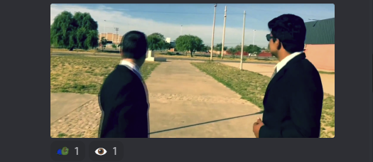
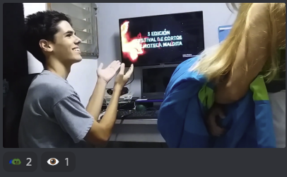

# [Inicial](./index.md)

[1](dia1.md) | [2](dia2.md) | [3](dia3.md) | [4](dia4.md) | [5](dia5.md) | [6](dia6.md) | [7](dia7.md) | [8](dia8.md) | [9](dia9.md) | [10](dia10.md) | [11](dia11.md) | [12](dia12.md) | [13](dia13.md) | [14](dia.md)
<h2>Día 5</h2>

## **Dia 5. Nº1: "11:59:00"**
- **Reseña**: Templando la edición y bordando la actuación esta pieza nos ofrece una trepidante aventura. La intriga y la acción aseguradas.
- **Números**: Nuestros  nueves (pierde un punto por los créditos que son caca).
- 

## **Dia 5. Nº2: "GrayBles"**
- **Reseña**: Confieso que adoro los videoclips de fusión y más si mezclan músicas tradicionales con alguna rama contemporánea. Me pasó en esta pieza que cerré los ojos; y, algo, me bailé. A la postre, y como tal, en el último tramo de la obra, no pude menos que abrirlos de nuevo, ojos anchos como platos (hasta cegarme y volverlos a cerrar). Un buen hip trip.
- **Números**: Mis nueves en punto.
- 

## **Dia 5. Nº3: "Lo que emerge"**
- **Reseña**: Una fotografía de ensueño, para una burbuja con textura onírica. ¿Qué es lo que emerge? El espectador tendrá que interpretar y comprender la historia, pero lo que está claro es que "eso que emerge" se transporta en la dicha burbuja; y, también, que para emerger, la burbuja parte de un realidad muy concreta (en tonos verdes y rojos). Una buena pieza de cine poético.
- **Números**: Mis nueves y medio.
- 

## **Dia 5. Nº4: "Buitres de asfalto"**
- **Reseña**: ¿Verdad que el traje grisáceo solo roto por alguna peripecia cromática de la corbata mezclado con maletines y con ese amor sobremedido al dinero automáticamente nos transporta, si no a Momo (de Ende), quizás al Lobo de Wall Street? 

Para todo lo demás: esta pieza, rodada de cabo a rabo, con ambiente, personajes y trama. Con mayor o menor fortuna, un rock del "yo por dinero mato" interpretado al compás. Sin florituras.
- **Números**: Mis ochos justicos.
- 

## **Dia 5. Nº5: "¿Sabes viajar en el tiempo?"**
- **Reseña**: Esta obrita es un refrescante cócktel para el verano. Un trago jugoso y cómodo de beber, que, además, sorprende con unos posos consistentes en cámara, actores, atrezzo, efectos y montaje del hilo narrativo. Al menos una (si no más) carcajada(s) te levanta. ¡Buena comedia!
- **Números**: Mis dieces con moñito.
- 

## **Dia 5. Nº6: "Indirecto"**

- **Pieza**: "Indirecto".
- **Reseña**: Allí donde mejor canta un maker (o un DIY; o un DIWO) tiene sitio esta pieza; muy apañada en lograr eso tópico de "con cuatro cositas que tenemos en casa". Este corto muy hábil de ingenio aunque justo en la actuación es una distopía trepidante que se subastaran los remakers y con opciones a pantalla grande. Una buena píldora de ciencia ficción que aspira a mediometraje.
- **Números**: Mis ochos coma noventa y nueve.
- 

## **Dia 5. Nº7: "Pasaje"**

- **Pieza**: "Pasaje".
- **Reseña**: La cámara acompaña a nuestro protagonista que nos abre las puertas de su vida privada, mostrándonos un cotidiano cualquiera. Eso sí, donde pone "cualquiera" queremos decir exactamente, literalmente, "cualquiera". Me gustaría que Jung visionara la pieza y probara de analizarlo, ¿sería para él un caso arquetípico? ¿Y si sí, autismo, esquizofrenia? En el chat comentan: entre Memento y Donnie Darko.
- **Números**: Mis sietes coma noventa mil.

- 

## **Dia 5. Nº8: "Dualidad"**
- **Reseña**: La comunidad de stopmotioneros y stopmotioneras se viste de gala para acoger a este recién llegado: una pequeña artesanía acerca de la dicotomía. Entre sus méritos resaltamos la encarnación del homo ludus situando el juego y el jugar entre dos jugadores. ¡Vaya juegazo!  
- **Números**: Mis treces (pero se restan 3 puntos [lo critíca el FeO: por falta de música], así que un diez).
-- 

## **Dia 5. Nº9: "Tasty"**
- **Reseña**: Una historia de esas que van hinchadas con metahistoria. Un plano exotérico nos vertebra esa metahistoria soltándonos pequeños fragmentos esotéricos de historias. Si te resultan embarradas las dos frases anteriores quizás sientas eso que sentí yo al acabar de verlo. Si por contra, acrisoladas las frases, para ti no son misterio, será que fuiste (y regresaste) como Ulises. Buen viaje de realismo mágico.
- **Números**: Mis sietes holgados.
- 

## **Dia 5. Nº10: "Chi no wadachi (fan animation)"**
- **Reseña**: En esta obra se curraron tantísimo los dibujos de una animación soberbia que exhaustos (diría) no alcanzaron a montar el sonido. Con la mirada atrapada en el alud de fotogramas nos olvidamos de este detalle e incluso de buscar el hilo de la historia. Gran obra de género (hace justicia al título).
- **Números**: Mis cincos (hasta el díez cuando lo envíe con música).
- 

## **Dia 5. Nº11: "Sin ideas"**
- **Reseña**: Reluce el leitmotiv de este corto en el núcleo de la trama y, no es para menos, parece que sus actores juegan en casa, con su público. Personalmente, la voz que más me gusta narrando lo de "el trabajo y las horas" es Pizarnik, mas, ¡gustos los colores!, ete aquí otra voz narrándolo. Un bonito lugar común.
- **Números**: Mis sietes con dos millones.
- 
