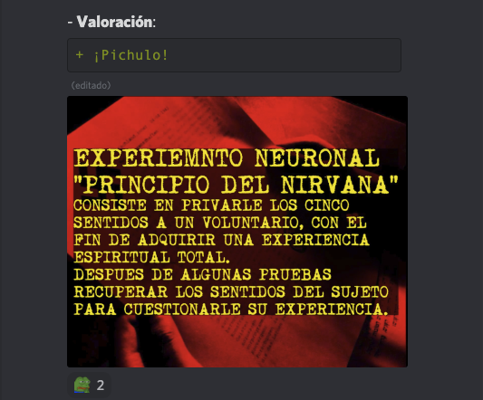

# [Inicial](./index.md)

[1](dia1.md) | [2](dia2.md) | [3](dia3.md) | [4](dia4.md) | [5](dia5.md) | [6](dia6.md) | [7](dia7.md) | [8](dia8.md) | [9](dia9.md) | [10](dia10.md) | [11](dia11.md) | [12](dia12.md) | [13](dia13.md) | [14](dia14.md)
<h2>Día 7</h2>

## **Dia 7. Nº 1: "__Enjoint__"**
- **Reseña**: ```Parece que enteógeno tiene dos sustancias etimológicas, a saber: "ente" que sería lo mismo que "en el interior"; y "geno" que nombra una cierta "espiritualidad". Este sencillo corto, seguro, resonó a muchos. Buen aperitivo.```
- 
- 

## **Dia 7. Nº 2: "__Animales Vertebrados __"**
- **Reseña**: ```Con mucha pericia esta pieza anima una bella puesta en escena llena de sensibilidad y buen gusto. ¡Incipit Vita Nova!```
- 


## **Dia 7. Nº 3: "__Algo de todo esto__"**
- **Reseña**: ```Una espiral de tres hilos que se teje entrelazando uno de esos mayestáticos Gran Tres. Naturaleza, Urbe y nosotros. Una ensalda de planos cuyo cocinero es un fotógrafo que ha sabido escoger los ingredientes. No es un primero, pero vale de entrante```
- 


## **Dia 7. Nº 4: "__Fobia social__"**
- **Reseña**: ``` Ejercicio de dialogismo abordando uno de los puntos calientes de nuestra época: la pospandemia. Meses de recogimiento y los pies en la orilla, ante un mar de posibilidad. El individuo ahí, preparado, ¡pero el agua está fresquita! Kierkegaard y Schopenhauer sentirían ternura (y respeto) por esta obra. Un requiem medianero.```
- 

## **Dia 7. Nº 5: "__Autodestrucción__"**
- **Reseña**: ```Existen símbolos fuertemente atados a signficados hondos de nuestro sistema nervioso. La punta de una aguja y un poco más de dosis en el chute es sin duda uno de estos. Así arranca este metraje que se enrolla narrativamente desde ese lugar común ayudándose con attrezo de serie b y cine negro. En el centro, muy a cuenta, gotas, destilándose lentamente, lo de Paracelso: “Todas las cosas son veneno y nada es sin veneno; Sólo la dosis hace que una cosa no sea un veneno". Thriller pretencioso.```
- 


## **Dia 7. Nº 6: "__Cazando perros__"**
- **Reseña**: ```Animación soberbia, sin aristas ni rayajos. El trazo dentro de la línea y texturas homogéneas. Quedé prendado con la forma y perdí atención a la historia de por qué se titula cazando perros y no, por ejemplo, Le Petit Prince versión dos punto cero. Buen cuentito.```
- 


## **Dia 7. Nº 7: "__Principio de Nirvana__"**
- **Reseña**: ```Un blanco y negro que mutará la nieve en sangre y luego en moras, y luego hierba, etc. Muy afilada creación de ingeniería psicológica que toca las notas de una eugenesia disuelta en el mestizaje tecnológico y el glitch charnego; a tres cuartos de siglo de la Gran Guerra. Un documental sobre la percepción del Atmán.```
- 


## **Dia 7. Nº 8: "__Bajo el árbol__"**
- **Reseña**: ```En cualquier época de nuestra vida, un ramo de flores que no acaba arrimándose a la nariz de un ser amado sino que cae al suelo y perece pisoteado abre una puerta a Dionisio, para embriagarse por olvido. En Bajo el árbol nos narran lo de la distancia, la desesperación y la angustia de esas flores caídas y, también, narran lo un jarrón con agua, como florero en el centro de la mesa. Y, narra, de jardines. Una romántica al uso.```
- 


## **Dia 7. Nº 9: "__Como decirte, me siento enterno.__"**
- **Reseña**: ```Una muda y en blanco/negro, interpretada en un monólogo sórdido aunque sin estridencias dentro de una pieza musical exquisita. Como un poema que apenas si ocupa en el folio, este corto busca ojos que lo lean. Buen verso.```
- 

## **Dia 7. Nº 10: "__Pienso en el final__"**
- 


## **Dia 7. Nº 11: "__Recuerdos__"**
- **Reseña**: ```Si Virgina Woolf sentara butaca junto a ti viendo este corto seguro en algún momento la notarías moverse inquieta. Melancolía y mar a partes iguales en un verso egográfico con gusto a salitre. Buen álbum de fotos.```
- 

## **Dia 7. Nº 12: "__Homo__"**
- **Reseña**: ```En un plano existencialista no hay otro motor que propulse el velero del vivir sino esas pocas fuerzas universales, como la gravedad. La gravedad en una gotera es un pulso suficiente para una primera parte introspectiva. Sirven la gotera y el grifo para que caiga un manantial de agua fresca con que lavarse la cara y dar paso a la segunda parte de la pieza, con el foco situado fuera, el héroe funde una mirada clara y despejada en lo cotidiano como fuerza universal. Tercera y última parte, la mirada objetiva, de nuevo, es subjetiva. Esta vez el pulso no es una gota cayendo sino otro de esos motores universales: latidos de corazón. Buena peli de susto. La banda sonora, buenísima.```
- 


## **Dia 7. Nº 13: "__Domingo__"**
- **Reseña**: ```toman vino y escriben versos. Para la ocasión se han propuesto voltear una historia de iniciación. Alguien que sale de un cascarón de infancia y queda expuesto suelto en un mundo que está ahí. Actores sobrios y edición regia. Un corto para domingo por la tarde (pero a última hora).```.
- 


## **Dia 7. Nº 14: "__(No) Te amo__"**
- **Reseña**: ```Una filmación de gran calidad visual, sonido apropiado y actores de trazo grueso. Ovillo de lanas sentimentales para un culebrón al uso que si el espectador quiere disfrutar tendrá que siturase en el epicentro de la tensión emocional. Un drama muy "in" con "trascendental"...```.
- 


## **Dia 7. Nº 15: "__My Boy (A love story)__"**
- **Reseña**: ```Cuidada fotografía; banda sonora en el sitio; un toque de caracterización, mención obligatoria. Diálogos escuetos en un guión claro y conciso. Va de lo de Romero; y esta pieza entra holgada en el género. Una de terror empoderado.```.
- 

# [Inicial](./index.md)

[1](dia1.md) | [2](dia2.md) | [3](dia3.md) | [4](dia4.md) | [5](dia5.md) | [6](dia6.md) | [7](dia7.md) | [8](dia8.md) | [9](dia9.md) | [10](dia10.md) | [11](dia11.md) | [12](dia12.md) | [13](dia13.md) | [14](dia14.md)
