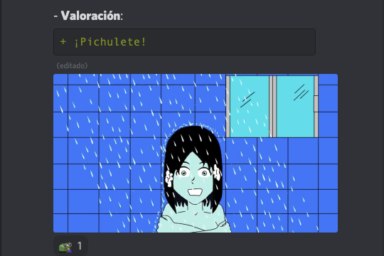

# [Inicial](./index.md)
<h2>Día 8</h2>

## **Día 8. Nº 1: "__Lo cotidiano de lo no cotidiano__"**
- **Reseña**: ```Una pieza disfuncional no apta para todos los gustos e, incluso, quizás, apto solo para muy pocos. Y, a pesar, entrevemos lo de lidiar y no arrugarse ante las dificultades. Una experimental que flojeó.```
- 


## **Día 8. Nº 2: "__Raro__"**
- **Reseña**: ```Una obra muda dentro de un track sonoro de permanente tensión poniendo a prueba la resistencia del espectador. Además, en la pista de audio, casi no se oyen unos susurros e igual pasa con el hilo narrativo. Una rara, rara.```
- 


## **Día 8. Nº 3: "__Niño pálido__"**
- **Reseña**: ```Jason de Viernes Trece tuvo un hijo. Este hijo en relaciones con la bruja de Blair tuvo una niña que a su vez se casó con el primogénito de Jodorowsky y tuvieron un niño. Que es quien filma la pieza. Una de miedo poco hilarante. ```
- 

## **Día 8. Nº 4: "__Anónimo__"**
- **Reseña**: ```La actriz de esta pieza toma la cámara y, sin más, a pelo, graba la historia espontánea, sin artificios. La trama discurre desembocando en un delta donde la mar, como una lengua, viene a recogernos. Lo tibio del río contrasta con la furia de las olas en la mar. Una de suspense psico.```
- 


## **Día 8. Nº 5: "__¡Ahí viene el pinche Coco!__"**
- **Reseña**: ```Lo de que el blanco y negro no es un simple filtro que se aplica al final aquí nos deslumbra a lo bruto. Monologuismo y amalgama de sombras y luces, sin contemplaciones. Diría que a Roland Topor esta obrita le daría gustirrinín en el ojete. Un cuento para leer a oscuras, con la linterna bajo la barbilla.```
- 


## **Día 8. Nº 6: "__Bicentenario: celebrar lo imposible.__"**
- **Reseña**: ```Independencia, dos puntos, ¿una ruptura o separación o alejamiento?; o, por contra, ¿un empoderamiento o un acto de soberanía o una emancipación? Buen título: ¿qué celebramos? Por desgracia, el "colonialismo" no trata de una corriente que impulsa el uso de perfume. Un documental de los que ponen espejos y dejan mirar al espectador.```
- 

## **Día 8. Nº 7: "__Cobrando una deuda__"**
- **Reseña**: ```En este corto, nada más llegar, descubrimos la presencia de un ingeniero. Perfecta imagen; sonido limpio. Lo bueno, si breve, dos veces. Compresión y destilación perfectas. Una de acción fugaz.```
- 

## **Día 8. Nº 8: "__YLLI__"**
- **Reseña**: ```Si son ciertas las teorías actuales, del primate provienen las civilizaciones antiguas que inventaron el Lenguaje. De estas nos llegó un océano de Mitos que tejieron con el lenguaje. Acrisolados todos, hace un par de milenios, en la forja de lo que dieron en llamar Logos, analizando y sintetizando mitos. Penúltimo estadio, en la modernidad inventan al humano: un Logos con Máscara. Para más info, busquen donde los símbolos y los arquetipos en Jung. Esta es una obra para la hipóstasis orgiástica. Un prósopon rotoscópico propio de la Academia de Atenas.```
- 


## **Día 8. Nº 9: "__Tutorial: "cómo ganar el festival de cine".__"**
- **Reseña**: ```Han pasado años ya desde que percibimos un nuevo escenario o lienzo o negativo donde filmar nuestro arte. Todavía, creo, salvo un par o tres escarceos, no se acepta la "grabación de pantalla" como una cámara con nombre en el cine. Esta pieza, en la vanguardia, abre paso para que la sigan. Un tutorial Loquendo que se sobra.```
- 


## **Día 8. Nº 10: "__Un día como otro__"**
- **Reseña**: ```Una animación molona de figuras nítidas y ortodoxas. Perfectamente podría pasar por el videoclip de un tema grunge si no fuera por un plot twist chingón y jocosamente resuelto haciendo malabares en la cuarta pared de la escena. Buena tira cómica; ¡¡no se pierdan su saga!!```
- 


## **Día 8. Nº 11: "__Compromisarios__"**
- **Reseña**: ```Fotografía estupenda, sonido de notable y actuación adecuada. Ejercicio de metacine superponiendo capas y creando espacio para todo. Así es fácil, y en este corto lo consiguen, mostrar un uróboros enrollado en una cinta de Moebius que tiene escritos todos los elementos de un conjunto Aleph. Una tragicomedia con trazas de suspense y susto, bordada.```
- 


## **Día 8. Nº 12: "__Viajero extra-dimensional (115)__"**
- **Reseña**: ```Maquetería resolutiva para montar un armazón solvente donde envasar un caldo narrativo con sustancia. Los efectos hacen eso liminar de pedir censurarlos o, a la vez, pedir aplauso en reconocimiento de lo ad hoc. Una de paranormal tontorrona.```
- **Valoración**:
- 


## **Día 8. Nº 13: "__Argos__"**
- **Reseña**: ```Argos aparece en el canto XVII, cuando Odiseo regresa a Ítaca luego de luchar en la Guerra de Troya y deambular por el mar, tras veinte años de ausencia. A parte, también hay un youtuber mongolo experto en sembrar cizalla cuya novia tiene un perro así llamado. Sin comentarios. ¡Buen stopmotion de acción!```.
- 

## **Día 8. Nº 14: "__La historia más larga__"**
- **Reseña**: ```Dos panes para un mini sandwich de carne de dinosaurio. El pan primero es de pulcra animación; el pan segundo es un troleo que, sin embargo, arranca la sonrisa. Buen chiste.```.
- 

## **Día 8. Nº 15: "__¿Qué es un héroe?__"**
- **Reseña**: ```Soberbia animación al trazo, blanco sobre negro, locutado histriónicamente con ritmo y cadencia. Pocos dardos no han dado en la diana. ¡Así, sí! Pilla palomitas cuando te lo vayas a poner. Una insigne de dibus.```.
- 