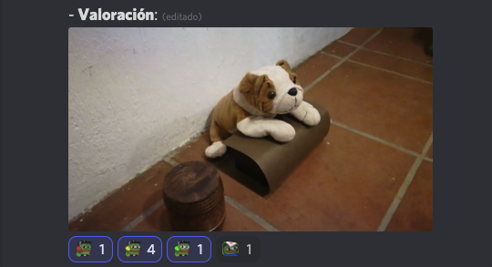
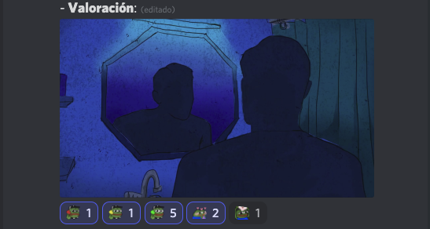
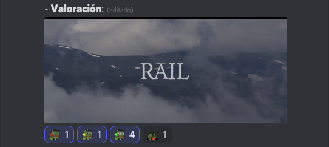
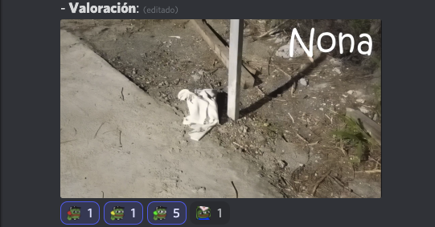

# [Inicial](./index.md)

[1](dia1.md) | [2](dia2.md) | [3](dia3.md) | [4](dia4.md) | [5](dia5.md) | [6](dia6.md) | [7](dia7.md) | [8](dia8.md) | [9](dia9.md) | [10](dia10.md) | [11](dia11.md) | [12](dia12.md) | [13](dia13.md) | [14](dia.md)
<h2>Día 9</h2>

  

## **Día 9. Nº 1: "__Ratero__"**
- **Reseña**: `Muy bien editado. Cumpliendo la regla a raja tabla: la cámara deber ser un móvil. Si no fuera porque las texturas son muy reales, el espectador puede creerse dentro de un juego. Un roleplay chingón.`
- 

## **Día 9. Nº 2: "__Catarsis__"**
- **Reseña**: `Una fotografía bellísima, puramente, de stock. Temazo al audio. Escenas no de primer mundo sino de mundo Zero. Y, sin embargo, lo que más apreciamos aquí es alguien que habla (inquiere) "desde fuera". Una de video arte justita. Igual resuena a Godard.`
- **Opta a premios**: Una para el Costa Gravas.
- 

## **Día 9. Nº 3: "__La incompetencia de Manuel__"**
- **Reseña**: `Un stop (sin motion) cómicamente narrado, fue al punto, al grano, a buscar la risa y lo rebancó. Una tierna...`
- 

## **Día 9. Nº 4: "__Mi amo__"**
- **Reseña**: `Exquisita animación; dulce y eficazmente narrada en una voz llena de impulso y fragancia. ¿Recuerdan a Mowgli? Me lo imagino protagonizando la de "Into the Wild". Una intimista.`
- **Opta a premios**: Bill Plympton.
- 

## **Día 9. Nº 5: "__bip.__"**
- **Reseña**: `Lo de la cámara neutra y el guionista mudo y los actores transparentes me funciona mucho cuando se sale al exterior. Que la realidad hable por sí misma indoors es menos gustosito; por eso muy agradecida la pista de sonido. Una de constumbrismo liviano (lleva reflexión sobre el consumo).`
- **Opta a premios**: Lav Diaz.
- 

## **Día 9. Nº 6: "__Sí__"**
- **Reseña**: `Un chistaco de vida monogámica en el hogar.`
- **Opta a premios**: Bretislav Pojar.
- 

## **Día 9. Nº 7: "__La aparición del coloso. Historia del ascenso y caída de El Nephlim.__"**
- **Reseña**: `El título es explícito. Tomas bonitas; muy pro. ¿Anda por ahí la Naranja Mecánica? ¿por ahí también el amarillo mejicano de Luis Estrada? Se rumorea en el stream que esta pieza superó a Pedró Pólvora. Una biografía en falso documental harto resultona.`
- **Opta a premios**: ¿Es esto un John Cassavetes?
- 

## **Día 9. Nº 8: "__Rail__"**
- **Reseña**: `La del Pico; y, en lugar de heroína, cobertura o gasolina. O la de París-Tombuctú; medio siglo después. Muchas otras, porque esta pieza pasa por una peli al uso. La banda que armó esta obra le dedicó tiempo y ganas y así les resultó pues talentosa... Una entrenida de viajes y aventuras.`
- **Opta a premios**: ¿Mario Brava? ¿Oldrich Lipsky? 
- 

## **Día 9. Nº 9: "__Fidel__"**
- **Reseña**: `na mezcla de la melancolía más grácil y melosa francesa junto al instrumentista Yann Tiersen. ¿Lo de los polos en las relaciones de pareja, no? O sea, un monólogo polar.`
- **Opta a premios**: Anger/Moctezuma. O Lav Diaz. O Bela Tarr.
- 

## **Día 9. Nº 10: "__Nona__"**
- **Reseña**: `Esta piecita rebosa comisura de labios y cejas arqueadas. Mofletes colorados, ojiplático rictus y, cómo no, tres o cuatro suspiros hondos, anchos, calmos. Una de monigote carismático.`
- **Opta a premios**: Un Monty Python.
- 

