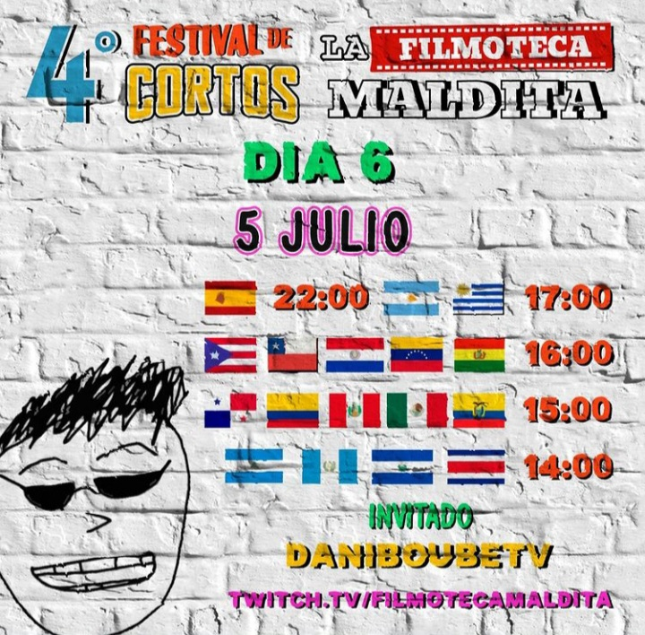
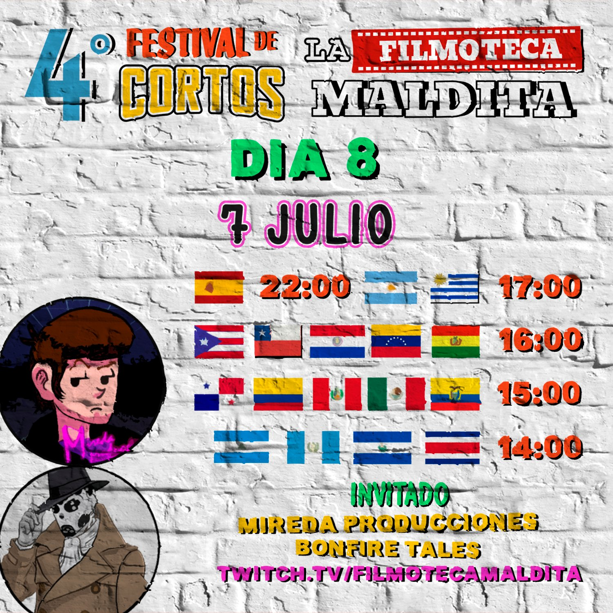

# IV Festival de Cortos de la Filmoteca Maldita 2022
SITIO FANTEAM NO OFICIAL 

En esta web tienes un resumen de los cortos proyectados.

- 
[Dia 1 30/06/2022 (Maquiavelo)](01/ficha.md)  
-   
[Dia 2 01/07/2022 (Café Kyoto)](02/ficha.md)  
-   
[Dia 3 02/07/2022 (Hergad / jchavarria_cine)](03/ficha.md)  
-   
[Dia 4 03/07/2022 (Quetzal)](04/ficha.md)  
-   
[Dia 5 04/07/2022 (Rottenmind + Yoshimichu)](05/ficha.md)  
-   
[Dia 6 05/07/2022 (DaniBoubeTv + Kenia)](06/ficha.md)  
-   
[Dia 7 06/07/2022 (Preguntas Incómodas)](07/ficha.md)  
-   
[Dia 8 07/07/2022 (Mireda Prod. + Bonfire Tales)](08/ficha.md)  
-   
[Dia 9 08/07/2022 (Maxi Contenti)](09/ficha.md)  

# Categorías de premios

  
  
  

